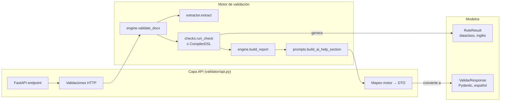

# Flujo del endpoint POST /validar

**Versión**: 1.1  
**Fecha**: 2026-09-23

---

## Diagrama de flujo completo

```mermaid
flowchart TD
    A[Frontend<br/>POST /validar<br/>multipart/form-data] --> B{¿Hay campo archivo?}
    B -->|No| C[422<br/>FastAPI: campo requerido]
    B -->|Sí| B2{¿Nombre vacío?}
    B2 -->|Sí| C2[400<br/>Campo archivo sin nombre]
    B2 -->|No| D{¿Extensión .docx?}
    D -->|No| E[415<br/>Tipo no soportado]
    D -->|Sí| F{Content-Type<br/>advisory check}
    F -->|No soportado| E
    F -->|OK / vacío| F2{¿correo presente<br/>y válido?}
    F2 -->|Inválido| F3[422<br/>Correo electrónico inválido]
    F2 -->|Válido / ausente / vacío| G[Leer contenido]
    G --> H{¿Tamaño > 10 MB?}
    H -->|Sí| I[413<br/>Archivo excede tamaño máximo]
    H -->|No| J{¿Archivo vacío?}
    J -->|Sí| K[422<br/>Archivo vacío]
    J -->|No| J2{¿Cabecera PK\x03\x04?}
    J2 -->|No| J3[422<br/>Cabecera ZIP inválida]
    J2 -->|Sí| L[Guardar en temp file]
    L --> M[engine.validate_docx<br/>+ build_report]
    M --> N{¿éxito?}
    N -->|ZIP corrupto / XML inválido| O[422<br/>DOCX inválido]
    N -->|Error inesperado| P[500<br/>Error interno]
    N -->|Éxito| Q{¿incluir_prompts_ia?}
    Q -->|true| R[build_ai_help_section]
    Q -->|false| S[prompts = []]
    R --> T[Construir ValidarResponse<br/>mapear RuleResult → DTO]
    S --> T
    T --> U[200 OK<br/>ValidarResponse JSON]
    L --> V[finally: unlink temp file]
    O --> V
    P --> V
    U --> V
```

---

## Capas de abstracción



---

## Detalle de validaciones HTTP

| Paso | Código | Condición |
|------|--------|-----------|
| Campo requerido | 422 | `archivo` no está en el request |
| Nombre de archivo | 400 | Campo presente pero `filename` vacío |
| Extensión | 415 | Nombre no termina en `.docx` |
| Content-Type | 415 | MIME type no es `.docx` ni `application/octet-stream` |
| Correo (opcional) | 422 | Campo `correo` presente pero formato inválido |
| Tamaño | 413 | Contenido > 10 MB |
| Vacío | 422 | 0 bytes |
| Magic bytes | 422 | Cabecera no es `PK\x03\x04` (no es ZIP) |
| DOCX corrupto | 422 | BadZipFile, KeyError (sin document.xml), ValueError, XML inválido |
| Error interno | 500 | Cualquier otra excepción |

---

## Mapeo motor → API (fieldName)

| Motor (`RuleResult`) | API (`ResultadoReglaAPI`) | Nota |
|----------------------|---------------------------|------|
| `rule_id` | `rule_id` | Sin cambio |
| `passed` | `paso` | Renombrado |
| `severity` | `severidad` | `"error"` o `"warning"` |
| `message` | `mensaje` | Renombrado |
| `expected` | `esperado` | Renombrado |
| `found` | `encontrado` | Renombrado |
| `location` | `ubicacion` | Renombrado |
| `fuente` | `fuente` | Sin cambio |
| `cita` | `cita` | Sin cambio |
| — | `metadatos` | Solo en API (nombre, tamaño, reglas, versión) |

---

## Semáforo (regla de negocio)

El semáforo **siempre** se calcula sobre **TODOS** los resultados, sin importar el filtro de severidad:

- `"rojo"` si **al menos una regla** `severity=error` falla (`passed=false`)
- `"verde"` si **todas** las reglas `severity=error` pasan
- Las `warning` no afectan el semáforo (pero sí aparecen en el reporte)

```python
# validator/engine.py:105-107
hay_error_bloqueante = any(
    (not r.passed) and r.severity == Severity.ERROR for r in results
)
semaforo = "rojo" if hay_error_bloqueante else "verde"
```

---

## Formatos de reglas soportados

El engine acepta dos formatos YAML, ambos producen `List[RuleResult]`:

| Formato | Key raíz | Evaluador | Estado |
|---------|----------|-----------|--------|
| Legacy | `rules` | `checks.run_check()` | Activo, estable (no es el que carga la API desde la F5) |
| DSL | `reglas` | `CompilerDSL` | Activo (Semana 3); **carga la API desde la F5 (Semana 4)** |

Detección automática en `engine.validate_docx()`:

```python
if "reglas" in rules_data:
    return CompilerDSL().ejecutar(rules_data, extracted)
return _validate_legacy(rules_data, extracted)
```
