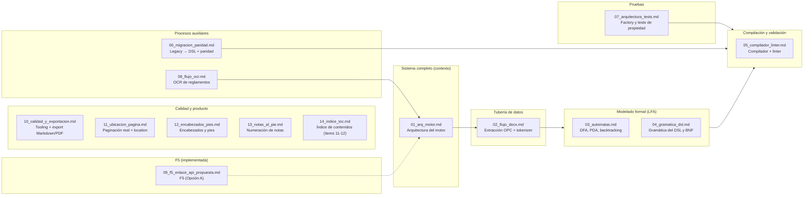
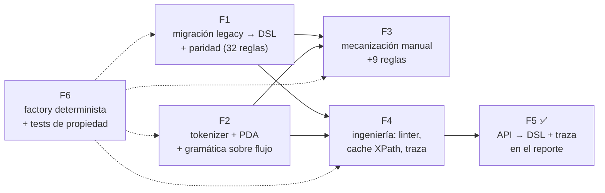

# Diseño del validador VistoBueno — Índice

> Documento: `00_indice_diseno.md`
> Autor: IvanSanchezSil (Integrante 3 — Motor de reglas / DSL)
> Rama: `semana4`
> Estado: **Borrador sin commit** — el motor, el DSL, el OCR y la migración
> se implementaron primero ("de frente"); este paquete documenta el diseño
> **a posteriori**: qué se construyó, cómo se modeló y por qué se decidió así.
> La F5 (doc 09) quedó **implementada** el 2026-09-15; el doc 10 (calidad y
> exportación) se agregó el 2026-09-16 como parte de las tareas 15 y 16; el
> doc 14 (índice de contenidos, ítems 11-12 de la F2) el 2026-09-22.

## 1. Propósito

El trabajo de este integrante (`motor`, `DSL`, `autómatas`, `OCR`,
`migración`, `tests de propiedad`) fue implementado en fases (F1–F6) sin
un documento de diseño previo. Este conjunto de documentos reconstruye el
diseño con la notación que debería haber acompañado a cada implementación:

- Diagramas de componentes, de secuencia y de flujo de datos (Mermaid).
- Modelado formal de los autómatas (DFA, PDA, gramática BNF) con sus
  diagramas de estados y la justificación matemática de cada decisión.
- Justificación técnica de cada decisión de diseño.
- Mapeo académico con las asignaturas de **LFA** (Lenguajes Formales y
  Autómatas) y **Compiladores**, en sección aparte por documento.

> Todos los diagramas usan **Mermaid** porque GitHub los renderiza de forma
> nativa (ya es el estándar usado en `docs/FLUJO_API.md` del equipo).

## 2. Mapa de documentos

| Doc | Área | Diagramas clave | Público |
|-----|------|-----------------|---------|
| **01** | Arquitectura del motor | Componentes, secuencia de validación | Todo el equipo |
| **02** | Extracción del DOCX | Flujo de datos, estados del tokenizer | Todo el equipo |
| **03** | Autómatas (LFA) | DFA real `estructura_tinv_*`, PDA, backtracking | LFA / Compiladores |
| **04** | Gramática del DSL | Árbol de derivación BNF, BNF del propio DSL | Compiladores |
| **05** | Compilador + linter | Pipeline de compilación, flujo del linter | Compiladores |
| **06** | Migración legacy→DSL | Flujo del migrador, proceso de paridad | Todo el equipo |
| **07** | Arquitectura de tests | Factory de DOCX, mutaciones, tests de propiedad | Todo el equipo |
| **08** | OCR de reglamentos | Flujo híbrido PyMuPDF + Tesseract | Todo el equipo |
| **09** | F5 (propuesta) | Enlace API → DSL, traza | Coordinación (API) |
| **10** | Calidad + exportación | Tooling (ruff/mypy/coverage/CI), export MD/PDF | Todo el equipo |
| **11** | Paginación + `location` | Mapa párrafo→página, `ultimo_nodo`, enriquecimiento | Todo el equipo |
| **12** | Encabezados y pies | Multi-parte header/footer, membrete y formato (ítem 2) | Todo el equipo |
| **13** | Notas al pie | `AnalizadorNotaPie`, numeración 1..N consecutiva (ítem 3) | Todo el equipo |
| **14** | Índice de contenidos | `AnalizadorTocApunta`/`AnalizadorTocNumeracion` (ítems 11-12) | Todo el equipo |

## 2.1 Fases de diseño F1–F6 (E)

Dependencias entre las fases del `PLAN_DSL.md` (versión Mermaid del diagrama
ASCII original):

- **F1** termina cuando la paridad `legacy ↔ DSL` es exacta sobre las 32
  reglas migradas y su test pasa.
- **F4** depende de F1 (el compilador necesita el DSL estable) y de F2 (el
  linter valida autómatas).
- **F2** habilita F3 (las secciones de conteo se acotan con el tokenizer).
- **F5** quedó **implementada** el 2026-09-15 (Opción A: enlace `api.py → reglas_unt.yaml` + traza en `found`; see doc 09).
- **F6** es la red de seguridad final: valida el sistema completo.

## 3. Convenciones

- **Fuente de verdad**: las configuraciones mostradas en los diagramas de
  estados provienen de `reglas_unt.yaml` (47 reglas) y de los tests
   `test_f2_automatas.py`; los nombres de módulos y clases reflejan el código
   real en `validator/`.
- **Fases del plan**: se referencian las fases F1–F6 de `docs/PLAN_DSL.md`
  (F1 migración, F2 tokenizer+PDA, F3 mecanización, F4 ingeniería, F5
  implementada, F6 tests de propiedad).
- **Equivalencias de color en diagramas**: se usan bordes dobles para los
  estados de aceptación y bordes discontinuos para estados opcionales
  (convención de teoría de autómatas).
- **Idioma**: español (convención del repositorio).

## 4. Cómo leer este paquete

1. Empiece por **01** (visión general) y **02** (qué se extrae del DOCX).
2. Siga con **03** y **04**: el modelado formal que le da sustento teórico
   al DSL.
3. **05** explica cómo se compila y se valida contra un documento.
4. **06** (migración), **07** (tests) y **08** (OCR) son procesos transversales.
5. **09** es la única propuesta a futuro (F5): el resto documenta lo ya
      implementado y verificado por la suite (213 tests).

---

## Mapeo académico (LFA / Compiladores)

| Concepto | Doc | Área académica |
|----------|-----|----------------|
| Autómata finito determinista (DFA) | 03 | LFA — autómatas finitos |
| Autómata de pila (PDA), lenguaje libre de contexto | 03 | LFA — jerarquía de Chomsky |
| Simulación NFA por backtracking (DFS) | 03 | LFA — equivalencia DFA/NFA |
| Gramática BNF libre de contexto | 04 | LFA — gramáticas; Compiladores — sintaxis |
| Árbol de derivación | 04 | Compiladores — parsing |
| Análisis léxico (tokenizer) | 02, 05 | Compiladores — fase 1 |
| Compilación / enlace con fábricas | 05 | Compiladores — pipeline |
| Verificación por propiedades (mutaciones) | 07 | Ingeniería de software — testing |
| Lenguaje específico de dominio (DSL) | 04, 05 | Ingeniería de software — DSL |