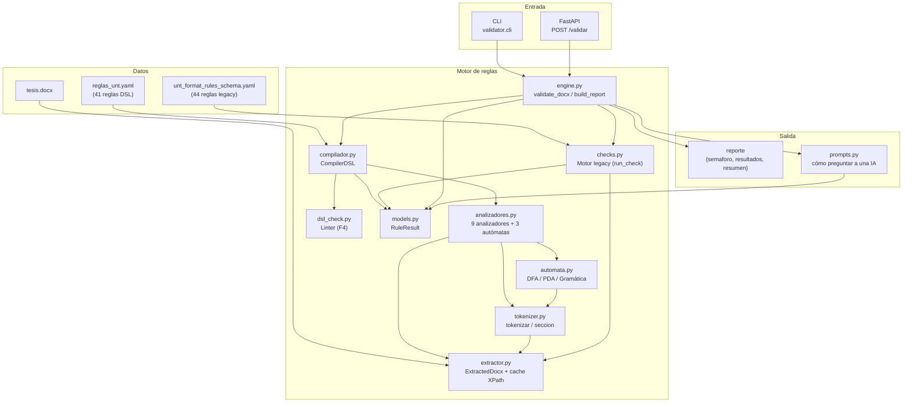
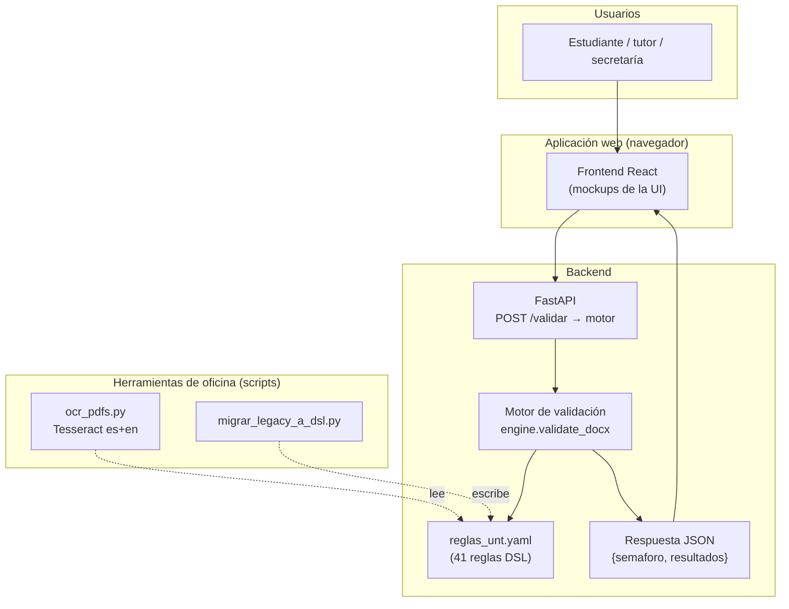
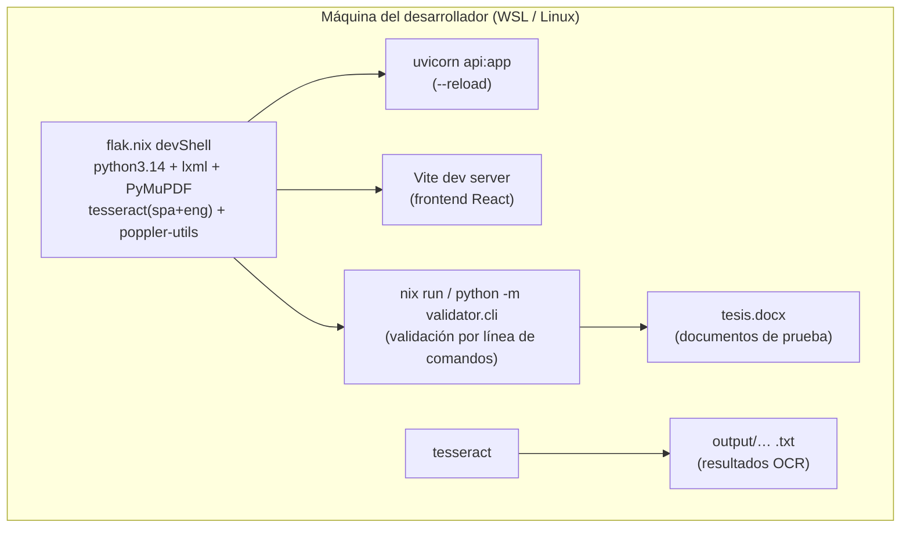
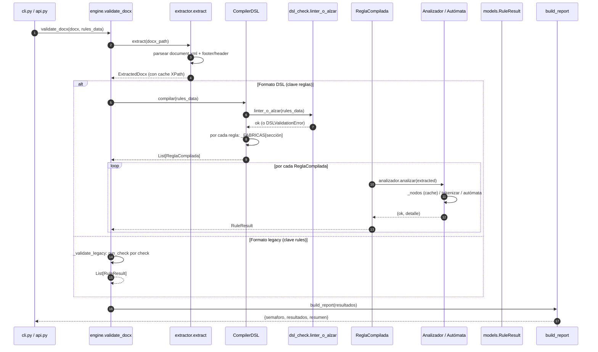
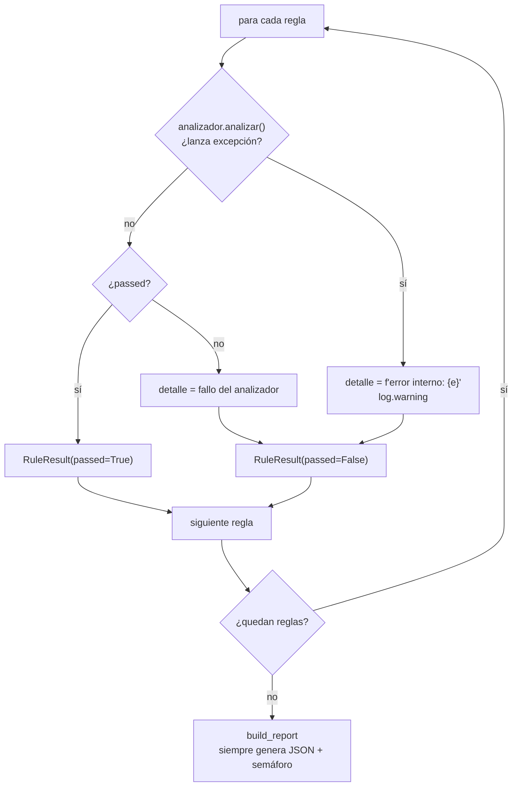
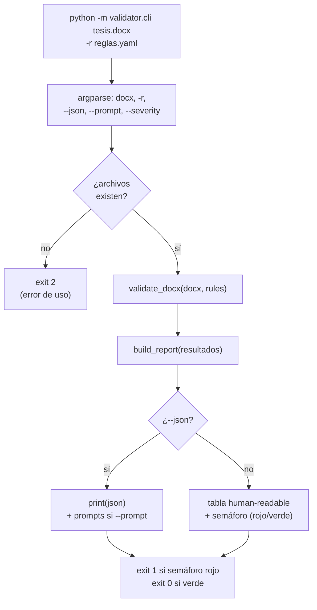
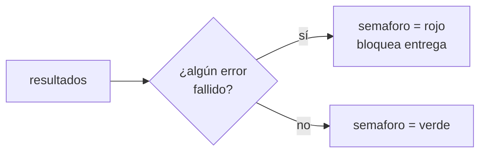

# Diseño — Arquitectura del motor de validación

> Documento: `01_arq_motor.md`
> Secciones: 1. Visión general · 2. Componentes · 3. Secuencia · 4. Contratos ·
> 5. Decisiones y justificación · 6. Mapeo académico

## 1. Visión general

El motor de validación de VistoBueno es responsable de **juzgar si un
archivo `.docx` cumple las reglas de formato de una tesis UNT** definidas
en un YAML de reglas. Su requisito de diseño principal (restricción del
proyecto): **no usar ningún LLM en el tiempo de ejecución** — la validación
debe ser determinista, verificable y reproducible.

El proyecto terminó con **dos motores** que conviven y que comparten el
mismo contrato de salida:

| Motor | Formato de reglas | Evaluador | Estado |
|-------|-------------------|-----------|--------|
| **Legacy** | `rules` + `mecanismo_verificable.checks` | `checks.run_check` | Compatibilidad |
| **DSL** | `reglas` con secciones de analizadores/autómatas | `CompilerDSL` | En producción (F1–F6) |

> La coexistencia es **deliberada y temporal**: permite migrar regla por
> regla sin romper la API ni el contrato. `engine.validate_docx` detecta el
> formato por la clave raíz del YAML.

## 2. Diagrama de componentes

### 2.1 Contexto del sistema completo (G)

Vista de contexto (C4 nivel 1) del producto completo, incluyendo el
frontend y la API que coordina otro integrante del equipo:

### 2.2 Despliegue (H)

El proyecto corre completo dentro del entorno Nix. No hay contenedores ni
servicios externos:

### Detalle de responsabilidades

| Módulo | Responsabilidad | Importa |
|--------|-----------------|---------|
| `extractor.py` | Abre el `.docx` (ZIP OPC), parsea `document/footer/header`, expone `xpath()` con caché | `lxml` |
| `tokenizer.py` | Análisis léxico del `<w:body>` → flujo tipado de tokens | `extractor` |
| `automata.py` | Lógica pura de autómatas (DFA, PDA) y gramática BNF | — (sin deps locales) |
| `analizadores.py` | Analizadores de hoja (XML, regex, lista, conteo, …) | `extractor`, `tokenizer` |
| `dsl_check.py` | Linter en tiempo de carga (regex, comparaciones, autómatas) | stdlib |
| `compilador.py` | YAML DSL → `ReglaCompilada` (fábricas + linter) → `RuleResult` | `analizadores`, `automata`, `dsl_check` |
| `checks.py` | Motor legacy: despacho de los 6 tipos de check | `extractor` |
| `engine.py` | Orquestador: detecta formato, delega, arma reporte | `checks`, `compilador`, `extractor`, `models` |
| `prompts.py` | Genera textos "cómo preguntar a una IA" por regla fallida | `models` |
| `models.py` | Contrato `RuleResult` (compartido por ambos motores) | stdlib |

> **Dependencia crítica (sin ciclo):** `dsl_check.py` **no** importa a
> `compilador.py`, y a la vez `compilador.py` sí importa a `dsl_check.py`
> (`compilador → dsl_check`). Si fuera al revés habría un ciclo de import.
> Por eso la tupla `SECCIONES_ANALIZADOR` (en `compilador`) está duplicada
> como `_SECCIONES` (en `dsl_check`): la duplicación es el precio pagado
> para mantener el grafo de dependencias acíclico.

## 3. Diagrama de secuencia (validación completa)

### Puntos de extensión

- **Agregar un tipo de check legacy**: implementar el despachador en
  `checks.run_check`.
- **Agregar una sección DSL**: crear la clase `Analizador`, registrarla en
  `SECCIONES_ANALIZADOR` + `_FABRICAS` (+ `_SECCIONES` del linter) y añadir
  ejemplo en `reglas_dsl_ejemplo.yaml`.

### 3.1 Manejo de errores (F)

El motor nunca aborta el reporte completo. Cada regla corre en su propio
contexto de excepciones (decisión D7):

La clave: un XML inesperado en `lxml` (p. ej. `ValueError` de `xpath()`) se
captura, se registra como `found` y se continúa. Las otras 40 reglas se
evalúan normalmente y el usuario recibe un reporte completo.

### 3.2 Flujo del CLI (J)

El CLI es la interfaz de referencia de línea de comandos (`validator.cli`):

Cuando `--json` y `--prompt` van juntos, el CLI imprime el JSON del reporte
más el campo `prompts` (textos generados por `prompts.py` para preguntar a
una IA). Esta es la interfaz que usarían otros scripts o CI/CD pipelines.

## 4. Contrato de datos: `RuleResult`

Ambos motores producen el **mismo** tipo de dato (`models.RuleResult`), lo
que desacopla a los consumidores (CLI, API, tests) del motor interno.

| Campo | Tipo | Uso |
|-------|------|-----|
| `rule_id` | `str` | Identificador de la regla |
| `passed` | `bool` | ¿Cumple? |
| `severity` | `Severity` (`error`/`warning`) | Gravedad |
| `message` | `str` | Descripción de la regla |
| `expected` | `str` | Valor esperado |
| `found` | `str` | Qué se encontró / faltantes |
| `location`, `fuente`, `cita` | `str` | Trazabilidad al manual |

### Regla de negocio del semáforo (justificación de diseño)

El semáforo se calcula **siempre** sobre *todos* los `error` fallidos,
independientemente del filtro por severidad aplicado al detalle del
reporte. Sin esta regla, un filtro de visualización **podría ocultar un
bloqueo real** y un documento inválido "aprobaría" ante los ojos del usuario.

## 5. Decisiones de diseño y justificación

| # | Decisión | Alternativa descartada | Justificación |
|---|----------|------------------------|---------------|
| D1 | Un solo tipo de salida `RuleResult` (contrato unificado) | Dos DTOs distintos por motor | Un consumidor (CLI/API/frontend) no sabe ni debe saber qué motor corre. Se preserva la paridad de contrato (ver `docs/DSL.md § Paridad`) |
| D2 | Coexistir con el motor legacy en vez de reemplazarlo | Reescribir de una vez | Migración incremental y verificable (F1): cada regla se migra, se testea paridad exacta `(passed, found)` y recién ahí se considera cerrada la fase. Reduce riesgo |
| D3 | Semáforo independiente del filtro de severidad | Semáforo sobre los resultados filtrados | Un filtro es una vista; la aprobación es un hecho duro. Máx(bloqueo) no puede depender de la vista |
| D4 | Linter en tiempo de **carga**, no de validación | Validar contra documentos | Un reglamento mal escrito (regex inválida, ciclo ε) **siempre** falla; detectarlo al cargar evita reportes engañosos y loops infinitos (F4) |
| D5 | `dsl_check` sin import a `compilador` (ciclo evitado) | Regcopiar en compilador | Grafo de dependencia acíclico (DAG); la tupla `_SECCIONES` duplicada es el costo aceptado |
| D6 | `prompts.py` es **template-based**, sin llamadas a LLM | Preguntar a un modelo en runtime | Restricción dura del proyecto ("sin LLM en runtime"); los prompts se generan estáticamente para que el usuario *consulte* luego |
| D7 | Los fallos de análisis nunca tiran el reporte (try/except interno) | Propagar la excepción | Un documento atípico (XML raro) no debe tumbar las 40 restantes reglas; cada fallo se registra con su detalle |

## 6. Mapeo académico (LFA / Compiladores)

- **Separación léxico / sintaxis / semántica**: el diseño separa al
  `tokenizer` (léxico) de los autómatas y gramáticas (sintáctica) y de los
  analizadores de hoja (semántica de regla). Esta es la estructura clásica
  de un compilador (fases 1–3).
- **Pipeline `compilar → linter → ejecutar`**: análoga al flujo de
  compilación (análisis estático → generación e IR → ejecución), tema de
  la asignatura Compiladores.
- **Determinismo**: la validación es una función pura sobre
  `(archivo, reglas)`, sin estado global mutable compartido salvo la caché
  de XPath por documento — requisito alineado con el concepto de *función
  computable* de la teoría de la computación.