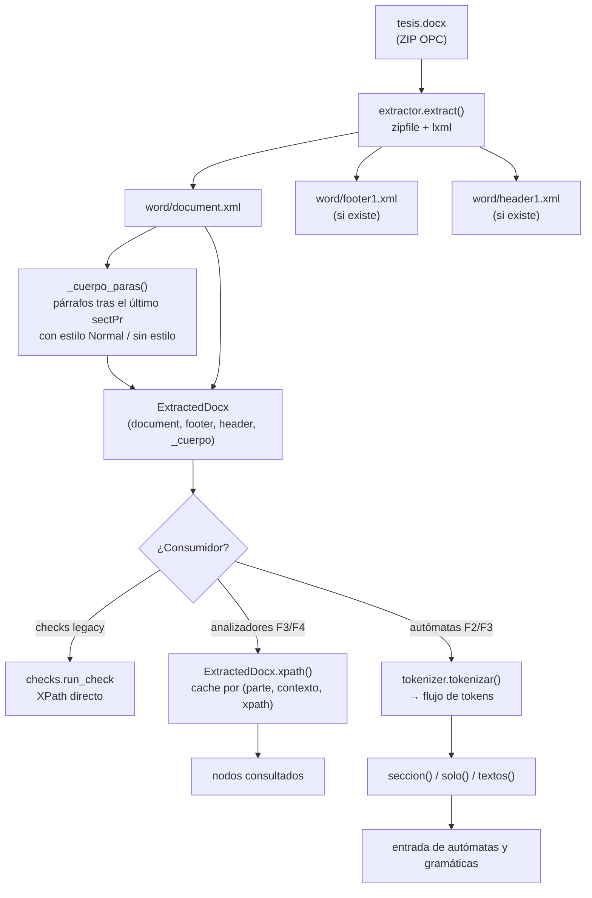
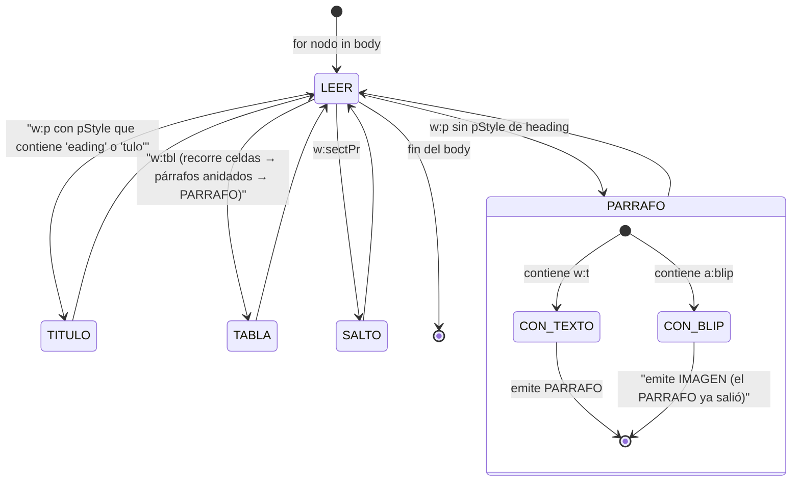
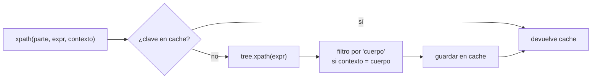

# Diseño — Tubería de extracción del DOCX y tokenización

> Documento: `02_flujo_docx.md`
> Secciones: 1. El formato DOCX (OPC) · 2. Flujo de datos · 3. El tokenizer ·
> 4. La caché de XPath (F4) · 5. Decisiones y justificación · 6. Mapeo académico

## 1. El formato DOCX (paquete OPC)

Un `.docx` es un **Zip** con convención OPC (Open Packaging Conventions).
El motor solo necesita 3 de las partes internas:

```
tesis.docx  (zip)
├── [Content_Types].xml      ← tipos de cada parte
├── _rels/.rels              ← relaciones raíz → word/document.xml
└── word/
    ├── document.xml         ← CONTENIDO PRINCIPAL (obligatorio)
    ├── footer1.xml          ← pie de página (opcional)
    ├── header1.xml          ← encabezado (opcional)
    └── ... (styles.xml, media/, etc. — no usados por el motor)
```

`word/document.xml` es un árbol WordprocessingML en el namespace
`w`, cuyas nodos significativos para el validador son:

| Nodo | Significado |
|------|-------------|
| `<w:p>` | Párrafo |
| `<w:pPr>` | Propiedades del párrafo (estilo, alineación…) |
| `<w:pStyle w:val="Heading1"/>` | Marca el título/subsección |
| `<w:r/><w:t>` | Run / texto (los `w:t` contienen el texto plano) |
| `<w:tbl><w:tc>...</w:tc></w:tbl>` | Tabla (su interior son párrafos anidados) |
| `<w:drawing>…<a:blip/></w:drawing>` | Imagen |
| `<w:sectPr>` | Salto de sección (final de sección del documento) |

## 2. Flujo de datos



### Ejemplo real de extracción

Para `reglas/unt_format_rules_schema.yaml` (legacy), los checks consultan
nodos como:

```yaml
xpath: //w:body//w:sectPr[1]/w:pgSz
atributo: "@w:w"
comparacion: eq
esperado: "11906"      # A4: 21 cm × 1184/96 ≈ 11906 twips
```

y el tokenizer (DSL) convierte los párrafos del `<w:body>` en un flujo:

```text
[CAPÍTULO I]       → TITULO   nivel 1
[texto de párrafo] → PARRAFO
[<w:tbl>]          → TABLA
[<w:drawing>blip]  → PARRAFO + IMAGEN   ← los párrafos anidados cuentan (paridad legacy)
[<w:sectPr>]       → SALTO_SECCION
```

## 3. El tokenizer (análisis léxico del body)

`tokenizer.tokenizar()` recorre los hijos de `<w:body>` **en orden de
documento** y clasifica cada párrafo/estructura:



> **Paridad clave**: los párrafos dentro de celdas de tabla generan
> `PARRAFO` (el motor legacy también los contaba). El test
> `test_parrafo_anidado_en_tabla` lo asegura.

### La función `seccion()` (F2/F3)

Recorta el flujo entre títulos: `seccion(flujo, "resumen", fin="anexos")`
devuelve los tokens posteriores al primer título que matchea `resumen` y
antes del título que matchea `anexos`. Sin match del inicio → lista vacía
(la regla cae como fallo). Es la base de las reglas F3 (`resumen_longitud`,
`referencias_minimo_*`, `anexos_minimos_*`, `palabras_clave_minimo`).

## 4. La caché de XPath (F4)

`ExtractedDocx.xpath(parte, xpath, contexto)` es el **punto único** por el
que consultan los analizadores. Cachea por clave `(parte, contexto, xpath)`:



Justificación cuantitativa: 41 reglas DSL ejecutan decenas de consultas
XPath; muchas comparten la misma expresión (por ejemplo, todas las de
tamaño consultan `w:rPr/w:sz`). Sin caché, el coste sería
`O(consultas × tamaño_árbol)`; con caché, cada `(parte, contexto, xpath)`
se resuelve **una única vez por documento**.

## 5. Decisiones de diseño y justificación

| # | Decisión | Alternativa descartada | Justificación |
|---|----------|------------------------|---------------|
| E1 | Leer **solo** `document.xml` + `footer1`/`header1` | Todo el paquete OPC | Las reglas UNT solo miran contenido, pie y cabecera; leer más partes es coste puro de parseo (los XML pesan MB) |
| E2 | "Cuerpo" = párrafos tras el **último** `<w:sectPr>` anidado en `w:pPr` con estilo Normal/sin estilo | Todo el `<w:body>` | La convención UNT ("formato del cuerpo") delimita el contenido de la **última sección**; los párrafos de portada/tablas con otros estilos no deben evaluarse como cuerpo |
| E3 | Tokenizer tipado (TITULO/PARRAFO/TABLA/IMAGEN/SALTO_SECCION) | Proyección de texto puro | Los autómatas y las secciones de F3 necesitan saber *qué* es cada elemento, no solo su texto; también hace visible la paridad legacy (párrafos anidados, blips) |
| E4 | Caché de XPath por documento (F4) | Re-ejecutar XPath por cada analizador | Complejidad temporal: `lxml.xpath` recorre el árbol en `O(|árbol|)` por llamada; la caché lo reduce a `O(|árbol|)` total por expresión única |
| E5 | `part()` lanza `ValueError` si la parte no existe | Devuelve `None` silencioso | Falla temprano y con mensaje claro si un XPath pide `footer` en un archivo sin pie (mejor error que falso negativo) |

## 6. Mapeo académico (LFA / Compiladores)

- **Análisis léxico**: el tokenizer es la *fase 1* de un compilador. La
  tabla de clases de tokens (`TITULO`, `PARRAFO`…) es el alfabeto sobre el
  que luego operan DFA y PDA.
- **Gramática regular del tokenizer**: cada párrafo se puede reconocer con
  un autómata finito que consulta `pStyle`; el conjunto de secuencias
  válidas de tokens es un lenguaje regular (LFA — tipos 3 de Chomsky).
- **Separación de capas**: `extractor` (I/O y XML) nunca conoce reglas;
  `tokenizer` conoce el formato pero no las reglas; los autómatas solo
  reciben proyecciones tipadas. Esto preserva la *ortogonalidad* entre
  analizador léxico y análisis sintáctico/semántico.