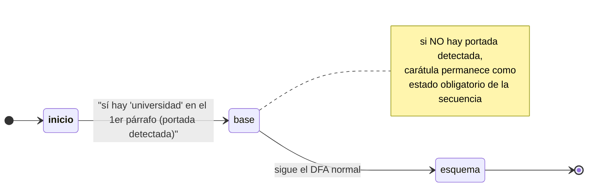
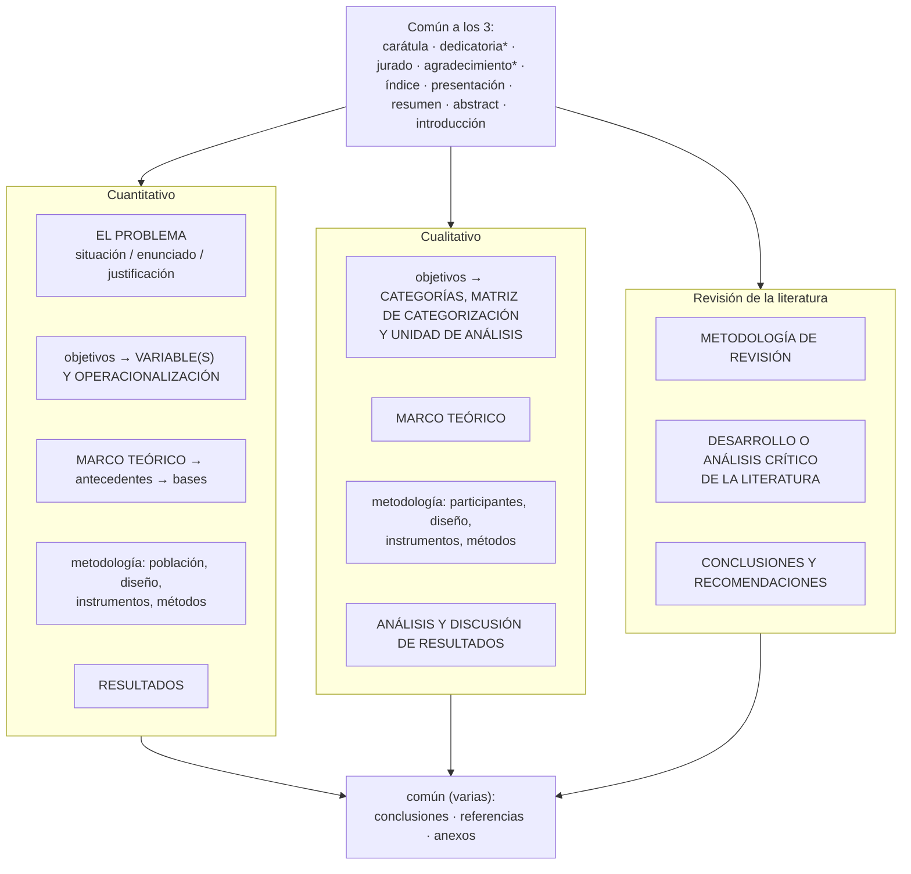
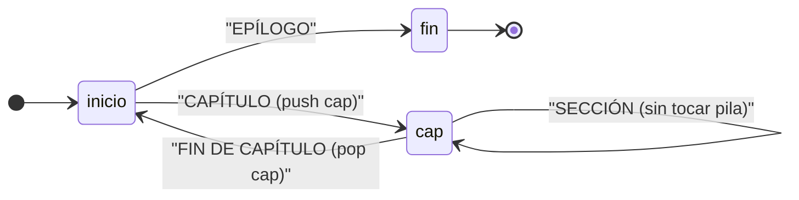
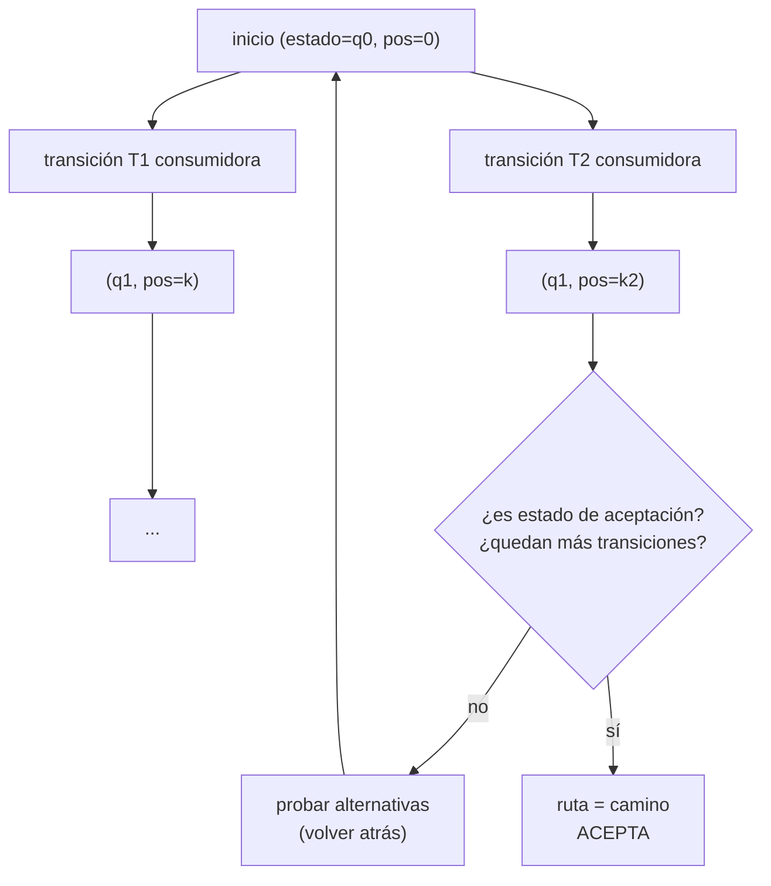

# Diseño — Autómatas del DSL: DFA, PDA y backtracking

> Documento: `03_automatas.md`
> Secciones: 1. Introducción formal · 2. DFA (`automata_secuencia`) ·
> 3. PDA (`automata_pila`) · 4. Backtracking (simulación NFA) ·
> 5. Clases en el código · 6. Decisiones y justificación ·
> 7. Mapeo académico

## 1. Introducción formal

El DSL modela la estructura del documento con autómatas. La justificación
teórica central es la **jerarquía de Chomsky**: distintos tipos de
obligaciones de formato exigen distintos tipos de autómatas.

| Obligación de formato | Lenguaje | Autómata adecuado |
|-----------------------|----------|-------------------|
| "Los títulos deben aparecer en este orden" | **Regular** (tipo 3) | DFA |
| "Las subsecciones deben abrirse y cerrarse (anidamiento)" | **Libre de contexto** (tipo 2) | PDA |
| "Delimitar una sección y contar sus elementos" | Análisis de tokens + aritmética | tokenizer + analizadores de conteo (no autómata) |

> La hipótesis de diseño: *las estructuras que un manual universitario
> obliga **por orden** son lenguajes regulares; las que obliga **por
> anidamiento** son lenguajes libres de contexto.* Esta clasificación es la
> que guía qué mecanismo se elige en el `reglas_unt.yaml`.

```
            DFA (tipo 3)     ⊂    PDA (tipo 2)      ⊂   Máquina de Turing
          orden de títulos      anidamiento            (indecidible en XML)
```

## 2. DFA — `automata_secuencia`

### 2.1 Definición

Un autómata finito determinista es la 5-tupla
`A = (Q, Σ, δ, q₀, F)`, donde:

- `Q` = estados (`caratula`, `jurado_evaluador`, `indice`, …)
- `Σ` = alfabeto = **texto normalizado de los títulos** (tokens `TITULO`)
- `δ: Q × Σ → Q` = transiciones con patrón sobre el token
- `q₀ = __inicio__` (estado ficticio antes del primer título)
- `F` = el **último estado obligatorio** (aceptación; llegar a él implica
  que todo lo anterior fue reconocido en orden)

Cada transición consume el *próximo* token que matchea su patrón
(búsqueda greedy hacia adelante). La entrada es la proyección de texto de
los títulos normalizada (`mayusculas`, `ignorar_indent`).

### 2.2 El DFA real de `estructura_tinv_cuantitativo`

Configuración extraída de `reglas_unt.yaml` (estados obligatorios, los
opcionales se omiten del autómata): **27 estados declarados**, de los cuales
2 son opcionales (`dedicatoria`, `agradecimiento`) → **25 estados
obligatorios** + el estado ficticio `__inicio__` = 26 nodos, con aceptación
en `ANEXOS`.

```mermaid
stateDiagram-v2
    direction LR
    [*] --> __inicio__
    __inicio__ --> caratula : CARÁTULA
    caratula --> jurado_evaluador : JURADO EVALUADOR
    jurado_evaluador --> indice : ÍNDICE
    indice --> presentacion : PRESENTACIÓN
    presentacion --> resumen : RESUMEN
    resumen --> abstract : ABSTRACT
    abstract --> introduccion : INTRODUCCIÓN
    introduccion --> el_problema : "EL PROBLEMA"
    el_problema --> situacion_problematica : "SITUACIÓN PROBLEMÁTICA"
    situacion_problematica --> enunciado_del_problema : "ENUNCIADO DEL PROBLEMA"
    enunciado_del_problema --> justificacion_o_importancia : "JUSTIFICACIÓN O IMPORTANCIA"
    justificacion_o_importancia --> objetivos : OBJETIVOS
    objetivos --> variable_s_y_operacionalizacion : "VARIABLE(S) Y OPERACIONALIZACIÓN"
    variable_s_y_operacionalizacion --> marco_teorico : "MARCO TEÓRICO"
    marco_teorico --> antecedentes_estado_del_arte : "ANTECEDENTES (ESTADO DEL ARTE)"
    antecedentes_estado_del_arte --> bases_teoricas : "BASES TEÓRICAS"
    bases_teoricas --> metodologia : METODOLOGÍA
    metodologia --> poblacion_y_muestra : "POBLACIÓN Y MUESTRA"
    poblacion_y_muestra --> diseno_de_investigacion : "DISEÑO DE INVESTIGACIÓN"
    diseno_de_investigacion --> instrumentos : "INSTRUMENTO(S) USADO(S) EN LA RECOLECCIÓN DE DATOS"
    instrumentos --> metodos : "MÉTODOS, TÉCNICAS Y PROCEDIMIENTOS USADOS EN EL ANÁLISIS E INTERPRETACIÓN DE DATOS"
    metodos --> resultados : RESULTADOS
    resultados --> conclusiones : CONCLUSIONES
    conclusiones --> referencias : REFERENCIAS
    referencias --> anexos : ANEXOS
    anexos --> [*]
```



**Los opcionales no aparecen**: `Dedicatoria` y `Agradecimiento` están
marcados `opcional: true`, por lo que `_build_dfa()` los **omite por
completo** del autómata (mismo comportamiento histórico del motor legacy:
los `(OPCIONAL)` simplemente no se exigen).



### 2.3 Comportamiento de reconocimiento (semántica)

El DFA recorre la proyección de títulos **sin retroceder** (`greedy`):

```
estado := __inicio__; pos := 0
repetir:
    encontrar la 1ª transición saliente de `estado`
    buscar en tokens[pos:] el 1er token que match su patrón
    si existe: estado := hacia; pos := found+1
    si no: atascado → reportar faltantes alcanzables
fin cuando no hay progreso
acepta ⟺ estado ∈ F
```

- La **portada** se satisface si el *primer párrafo del documento* contiene
  "universidad" (no usa estilo de encabezado). Si no se detecta portada, el
  estado `caratula` se mantiene como obligatorio.
- Los tokens que no matchean ninguna transición actual **se omiten** (el
  puntero avanza buscando el siguiente match). Esto tolera títulos
  extra/intermedios y es lo que permite que un mismo autómata reconozca el
  documento con los esquemas alternativos insertados (ver `07`).

### 2.4 Los otros dos esquemas (A1/A2)

El reglamento define **tres esquemas de estructura**. Además del
cuantitativo (2.2), existen dos DFA más en `reglas_unt.yaml`.

**`estructura_tinv_cualitativo`** — 22 estados declarados, 2 opcionales →
20 obligatorios. Cambios clave vs cuantitativo: tras `OBJETIVOS` exige
`CATEGORÍAS, MATRIZ DE CATEGORIZACIÓN Y UNIDAD DE ANÁLISIS` (en vez de
`VARIABLE(S)`), y termina con `ANÁLISIS Y DISCUSIÓN DE RESULTADOS` (en vez
de `RESULTADOS`).

```mermaid
stateDiagram-v2
    direction LR
    [*] --> __inicio__
    __inicio__ --> caratula : CARÁTULA
    caratula --> jurado_evaluador : JURADO EVALUADOR
    jurado_evaluador --> indice : ÍNDICE
    indice --> presentacion : PRESENTACIÓN
    presentacion --> resumen : RESUMEN
    resumen --> abstract : ABSTRACT
    abstract --> introduccion : INTRODUCCIÓN
    introduccion --> el_problema : "EL PROBLEMA"
    el_problema --> objetivos : OBJETIVOS
    objetivos --> categorias : "CATEGORÍAS, MATRIZ DE CATEGORIZACIÓN Y UNIDAD DE ANÁLISIS"
    categorias --> marco_teorico : "MARCO TEÓRICO"
    marco_teorico --> metodologia : METODOLOGÍA
    metodologia --> participantes : PARTICIPANTES
    participantes --> diseno : DISEÑO
    diseno --> instrumentos : "INSTRUMENTOS USADOS EN LA RECOLECCIÓN DE INFORMACIÓN"
    instrumentos --> metodos : "MÉTODOS, TÉCNICAS, PROCEDIMIENTOS Y ESTRATEGIAS USADAS EN EL ANÁLISIS E INTERPRETACIÓN DE DATOS"
    metodos --> analisis_discusion : "ANÁLISIS Y DISCUSIÓN DE RESULTADOS"
    analisis_discusion --> conclusiones : CONCLUSIONES
    conclusiones --> referencias : REFERENCIAS
    referencias --> anexos : ANEXOS
    anexos --> [*]
```



**`estructura_tinv_revision_literatura`** — 14 estados declarados, 2
opcionales → 12 obligatorios. Es el esquema más corto; tras `INTRODUCCIÓN`
va directo a `METODOLOGÍA DE REVISIÓN` sin sub-estados de problema.

```mermaid
stateDiagram-v2
    direction LR
    [*] --> __inicio__
    __inicio__ --> caratula : CARÁTULA
    caratula --> jurado_evaluador : JURADO EVALUADOR
    jurado_evaluador --> indice : ÍNDICE
    indice --> presentacion : PRESENTACIÓN
    presentacion --> resumen : RESUMEN
    resumen --> abstract : ABSTRACT
    abstract --> introduccion : INTRODUCCIÓN
    introduccion --> metodologia_revision : "METODOLOGÍA DE REVISIÓN"
    metodologia_revision --> desarrollo_critico : "DESARROLLO O ANÁLISIS CRÍTICO DE LA LITERATURA"
    desarrollo_critico --> conclusiones_recomendaciones : "CONCLUSIONES Y RECOMENDACIONES"
    conclusiones_recomendaciones --> referencias : REFERENCIAS
    referencias --> anexos : ANEXOS
    anexos --> [*]
```



### 2.5 Comparativa de los tres esquemas (B)

Los tres comparten el prefacio (carátula → … → abstract) y el cierre
(conclusiones · referencias · anexos). Divergen en el cuerpo:



### 2.6 La traza `ruta_estados` (C)

Durante `reconocer()`, el DFA registra en `ruta_estados` la secuencia de
estados que recorrió. La traza permite saber **exactamente dónde se desvió**
el documento. Ejemplo: un documento que llega hasta `MARCO TEÓRICO` pero
omite el heading `METODOLOGÍA` (excerpt del esquema para legibilidad):

```mermaid
stateDiagram-v2
    direction LR
    classDef hecho fill:#d5f5e3,stroke:#27ae60,stroke-width:2px
    classDef atascado fill:#fadbd8,stroke:#c0392b,stroke-width:2px
    classDef esperado fill:#f6f6f6,stroke:#95a5a6,stroke-dasharray: 3

    [*] --> intro
    intro --> el_problema
    el_problema --> objetivos
    objetivos --> variable
    variable --> marco
    marco --> metodologia
    metodologia --> resultados
    resultados --> conclusiones
    conclusiones --> referencias

    class intro hecho
    class el_problema hecho
    class objetivos hecho
    class variable hecho
    class marco hecho
    class metodologia atascado
    class resultados esperado
    class conclusiones esperado
    class referencias esperado
```



Verde = estados recorridos; rojo = donde el autómata se atascó (no encontró
el heading `METODOLOGÍA`); gris discontinuo = estados esperados que no se
alcanzaron. Esta ruta es la información que F5 quiere reportar al usuario
(`09_f5_enlace_api_propuesta.md`).

## 3. PDA — `automata_pila`

### 3.1 Definición

Un autómata de pila determinista se define como
`P = (Q, Σ, Γ, δ, q₀, Z₀, F)`, con `Γ` = alfabeto de la pila y `Z₀` el
símbolo de fondo. La máquina agrega una pila a los estados:

- `push(símbolo)`: apilar al dispararse la transición (abrir un nivel).
- `pop(símbolo)`: desapilar **exigiendo** que el tope sea `símbolo`
  (cerrar el nivel correcto).

**Criterio de aceptación**: `estado ∈ F  Y  pila vacía`. Si se llega a un
estado final con pila no vacía, la estructura quedó **sin cerrar**.

### 3.2 PDA del test F2 (`test_acepta_balanceado`)

Extraído de `test_f2_automatas.py` (config pura del `PDA`):

```
estados        : {__inicio__, cap, fin}
inicial        : __inicio__
aceptación     : {fin}
transiciones:
    __inicio__ --CAPÍTULO, push(cap)--> cap
    cap        --SECCIÓN            --> cap
    cap        --FIN DE CAPÍTULO, pop(cap)--> __inicio__
    __inicio__ --EPÍLOGO           --> fin
```



Ejecución sobre `["CAPÍTULO I", "SECCIÓN 1.1", "FIN DE CAPÍTULO", "EPÍLOGO"]`:

| Token leído | Transición | Pila |
|-------------|------------|------|
| — | estado inicial | `[]` |
| CAPÍTULO I | `→ cap, push(cap)` | `[cap]` |
| SECCIÓN 1.1 | `loop cap → cap` | `[cap]` |
| FIN DE CAPÍTULO | `→ __inicio__, pop(cap)` | `[]` |
| EPÍLOGO | `→ fin` | `[]` |
| — | **estado=fin ∧ pila=[]** → ✅ | | 

**Rechazo por estructura sin cerrar**: `["CAPÍTULO I", "SECCIÓN 1.1", "EPÍLOGO"]`
termina en `fin` con pila `[cap]` → reporta `"estructura sin cerrar: falta cap"`.

**Rechazo por tope de pila inesperado**: transición `pop("seccion")` cuando
la pila está vacía o el tope es otro símbolo → `"tope de pila inesperado"`.

### 3.3 PDA vía DSL (`automata_pila` end-to-end)

La regla `estructura_capitulos` del test `TestAutomataPilaDSL` demuestra el
mismo PDA consumiendo **títulos del documento**:

```yaml
automata_pila:
  tipo_flujo: titulos
  inicial: inicio
  aceptacion: [fin]
  transiciones:
    - {desde: inicio, hacia: cap,   patron: CAPÍTULO,        push: cap}
    - {desde: cap,    hacia: cap,   patron: SECCIÓN,         }
    - {desde: cap,    hacia: inicio, patron: FIN DE CAPÍTULO, pop: cap}
    - {desde: inicio, hacia: fin,   patron: EPÍLOGO,         }
```

### 3.4 Refutación de que un DFA basta (justificación formal)

El lenguaje de los capítulos balanceados es
`L = { CAPÍTULO SECCIÓNⁿ FIN DE CAPÍTULO ... }`. Por el **lema de
bombeo de lenguajes regulares**, `L` no es regular: si lo fuera, existiría
`p` tal que un string `w = CAPÍTULO SECCIÓN^p FIN DE CAPÍTULO` con
`|w| ≥ p` se podría bombear; pero el bombeo alteraría el número de
SECCIÓNes y rompería el balance requerido por la semántica. Luego se
requiere la memoria de la pila → **PDA** (tipo 2).

## 4. Backtracking — simulación de NFA (DFS)

El DFA greedy nunca retrocede; el modo `backtracking` simula un autómata
no determinista (NFA) mediante **búsqueda en profundidad** con memoización
sobre `(estado, pos)`:

```
_DFS(estado, pos):
    si estado ∈ F → devuelve ruta
    para cada transición saliente:
        si consumir=False → _DFS(hacia, pos)
        para k in pos..len(tokens): si matchea → _DFS(hacia, k+1)
    memoiza (estado, pos) para no recomputar
acepta ⟺ algún camino llega a F
```



- **Coste**: peor caso exponencial en el número de transiciones, por eso es
  **opt-in** (`reconocimiento: backtracking`) y el default es `greedy`.
- **Memoización**: `visitados = set[(estado, pos)]` acota la búsqueda y
  evita recomputar subespacios, al estilo del *parsing* de programas
  dinámicos de CYK.

## 5. Clases en el código (`validator/automata.py`)

| Clase | Contenido |
|-------|-----------|
| `Transicion` | `(desde, hacia, patron, consumir)` — arista del DFA |
| `DFA` | `reconocer()` greedy, `reconocer_con_backtracking()` DFS, `ruta_estados` (traza F4), `_siguientes_aceptables()` (reporte de faltantes) |
| `TransicionPDA` | = `Transicion` + `push`/`pop` |
| `PDA` | `reconocer()` greedy con pila; acepta solo con `estado ∈ F ∧ pila=[]` |
| `GramaticaEstructura` | (ver documento 04) |

El hook de **matcher** (`DFA(matcher=...)`, `PDA(matcher=...)`) permite que
`compilador.AutomataSecuencia` inyecte la semántica `_matchea_legacy`
(startswith + prefijo + token significativo) y así **preservar la paridad
de comportamiento** con el motor legacy `checks._check_secuencia`.

## 6. Decisiones de diseño y justificación

| # | Decisión | Alternativa descartada | Justificación |
|---|----------|------------------------|---------------|
| A1 | DFA para secuencia de títulos | Chekcs ad-hoc por regla | Un único mecanismo general declarativo reemplaza N ifs; el autómata *es* el esquema del manual y produce reportes consistentes de "qué falta" |
| A2 | **greedy** como default | Siempre backtracking | Paridad histórica con legacy (el puntero nunca retrocede) + rendimiento lineal esperado. El backtracking es opt-in para casos ambiguos |
| A3 | Aceptación = último estado obligatorio | Conjunto explícito de finales | "Llegar al último implica haber pasado por todos en orden" — suficiente y sin errores de configuración |
| A4 | PDA: aceptación = estado final **y pila vacía** | Solo estado final | Distingue "estructura cerrada" de "estructura abierta sin cerrar"; el mensaje `estructura sin cerrar` es feedback útil |
| A5 | Opcionales **omitidos** del autómata | Estados con transición ε | Igual que legacy (`(OPCIONAL)` no se exige); evita agregar ε-transiciones y su coste de búsqueda |
| A6 | `pop` exige el símbolo en el tope | `pop` ciego | Detección temprana de anidamiento mal cerrado (tope inesperado) en lugar de unborrar silencioso de la pila |
| A7 | Matcher inyectable para paridad legacy | Matcher genérico único | La F1 exige que DSL acepte **exactamente** lo que aceptaba legacy (`startswith`/prefijo/token significativo); sin esto no hay paridad |
| A8 | Traza `ruta_estados` (F4) | Sin traza | Necesaria para F5 (reportar dónde falló el documento) y para depuración |

## 7. Mapeo académico (LFA / Compiladores)

- **LFA — autómatas finitos**: DFA (sección 2) es directamente el objeto
  estudiado en la asignatura; los diagramas de estados (2.2) usan la
  notación canónica de estados de aceptación.
- **LFA — jerarquía de Chomsky**: la elección DFA (tipo 3) vs PDA (tipo 2)
  formalizada en 3.4 (lema de bombeo) es el núcleo del argumento de diseño.
- **LFA — equivalencia NFA/DFA**: la simulación de NFA por DFS (sección 4)
  es la construcción "conjunto de estados activos" hecha exploración.
- **Compiladores — parsing**: la memoización `(estado, pos)` del
  backtracking es el mismo principio del algoritmo CYK / de los parsers
  descendentes con retro-consulta; la traza `ruta_estados` anticipa el
  "mensaje de error del compilador".