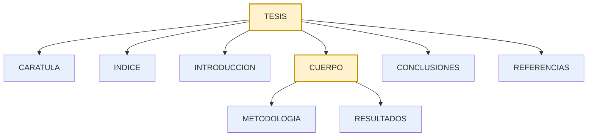
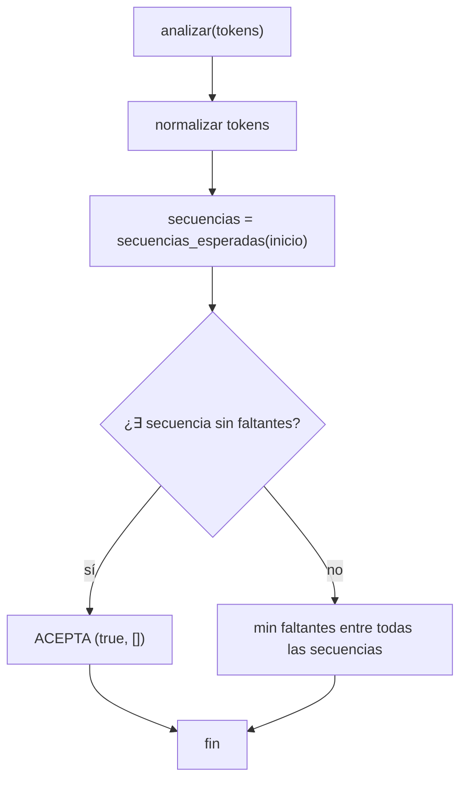
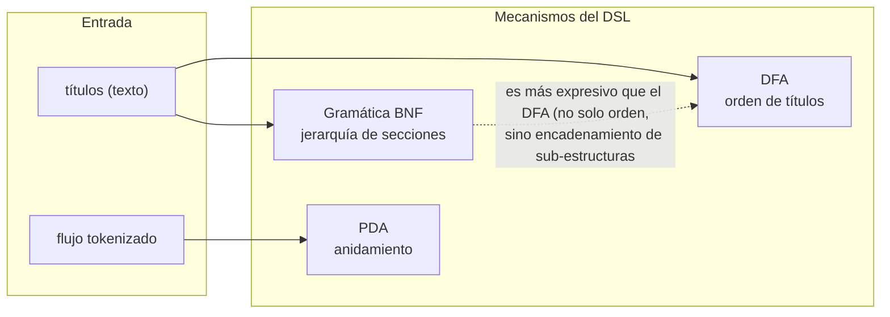

# Diseño — Gramática del DSL

> Documento: `04_gramatica_dsl.md`
> Secciones: 1. DSL declarativo · 2. Gramática del propio DSL ·
> 3. Gramática BNF de estructura (`gramatica_estructura`) ·
> 4. Árbol de derivación · 5. Parser descendente recursivo ·
> 6. Decisiones y justificación · 7. Mapeo académico

## 1. El DSL declarativo de validación

VistoBueno usa un **lenguaje específico de dominio** (DSL) escrito en YAML
para declarar las reglas de formato. Es la "gramática" de más alto nivel:
describe la sintaxis de un `reglas_unt.yaml` válido.

```yaml
namespaces: { w, r, a, pic }
reglas:
  - id: <string>
    tipo: <string>
    descripcion: <string>
    valor_esperado: <string | list>
    severidad: error | warning
    fuente / ubicacion / cita: <string>
    # una o varias secciones de analizador — TODAS deben cumplirse:
    atributo_xml | presencia_xml | patron_texto | lista_texto | imagen |
    automata_secuencia | gramatica_estructura | automata_pila |
    patron_cantidad | conteo_nodos | lista_obligatoria | hipervinculo_texto
```

## 2. La gramática del propio DSL (formato BNF)

Se puede expresar el conjunto de archivos DSL válidos con una gramática
libre de contexto (los no-terminales se escriben en mayúsculas):

```
DSL        → "namespaces:" NAMESPACES "reglas:" REGLA+
NAMESPACES → "{" ns_w ns_r ns_a ns_pic "}"
REGLA      → "id:" STR "tipo:" STR "descripcion:" STR
             "valor_esperado:" VAL "severidad:" SEV
             META? SECCION+
VAL        → STR | LISTA
SEV        → "error" | "warning"
META       → ("fuente:" | "ubicacion:" | "cita:") STR
SECCION    → ATRIBUTO | PRESENCIA | PATRON | LISTA | IMAGEN |
             AUTOMATA_SEQ | GRAMATICA | AUTOMATA_PILA | CONTEO | OBLIGATORIA | HIPERVINCULO
AUTOMATA_SEQ → "automata_secuencia:" "normalizacion:" LISTA
               "reconocimiento:" ("greedy" | "backtracking")
               "estados:" ESTADO+
ESTADO     → "nombre:" STR "patron:" STR "original:" STR "opcional?" BOOL?
```

> No se pretende que esta BNF sea ejecutable; documenta **qué configuración
> es legal** para el `linter` (`dsl_check.py`, ver 05), que es quien aplica
> esta gramática de forma práctica.

## 3. Gramática BNF de estructura — `gramatica_estructura`

La sección `gramatica_estructura` del DSL permite declarar la estructura
jerárquica completa con **producciones BNF** reales (no solo secuencias
planas). Ejemplo canónico del `docs/DSL.md`:

```yaml
reglas_sintacticas:
  - "TESIS → CARATULA INDICE INTRODUCCION CUERPO CONCLUSIONES REFERENCIAS"
  - "CUERPO → METODOLOGIA RESULTADOS"
terminales:  [CARATULA, INDICE, INTRODUCCION, METODOLOGIA, RESULTADOS, CONCLUSIONES, REFERENCIAS]
no_terminales: [TESIS, CUERPO]
inicio: TESIS
```

### Producciones formales

```
S = TESIS
TESIS → CARATULA INDICE INTRODUCCION CUERPO CONCLUSIONES REFERENCIAS
CUERPO → METODOLOGIA RESULTADOS
terminales     Σ = { CARATULA, INDICE, INTRODUCCION, METODOLOGIA,
                     RESULTADOS, CONCLUSIONES, REFERENCIAS }
no_terminales  N = { TESIS, CUERPO }
```

### Árbol de derivación de la secuencia esperada



Leyenda: nodos **ámbar** = no-terminales (derivables), nodos **azules** =
terminales (directamente comparables con los títulos del documento).

### Derivaciones del parser

`derivaciones(símbolo)` y `secuencias_esperadas()` expanden el inicio hasta
obtener **todas las cadenas de terminales** aceptables:

```
secuencias_esperadas(TESIS) =
    [ CARATULA INDICE INTRODUCCION METODOLOGIA RESULTADOS
      CONCLUSIONES REFERENCIAS ]
```

El parser entonces comprueba que los headings del documento cubran (en
orden) **una** de esas secuencias, contando los faltantes con la secuencia
que menos faltantes produzca (mejor aproximación).

### `tipo_flujo: documento` (F2)

La gramática puede consumir el **flujo tokenizado completo** (no solo
títulos) especificando `tipo_flujo: documento` y `tipos: [TITULO, PARRAFO]`.
En el test `TestGramaticaConTokens`:

```yaml
gramatica_estructura:
  tipo_flujo: documento
  tipos: [TITULO, PARRAFO]
  reglas_sintacticas: ["TESIS → INTRODUCCIÓN RESULTADOS "]
  terminales: [INTRODUCCIÓN, RESULTADOS]
  no_terminales: [TESIS]
  inicio: TESIS
```

Permite exigir que entre títulos no haya "piezas sueltas"; el parser
normaliza cada token (mayúsculas, sin espacios múltiples) igual que con
los headings.

## 4. El parser descendente recursivo



Cada candidata se evalúa con `_faltantes_en_secuencia(seq, tokens)`: se
recorre `seq` en orden buscando cada ítem en los tokens desde la última
posición (subsecuencia, no subcadena contigua):

```
pos := 0; faltantes := []
para cada ítem de la secuencia:
    encontrar el 1er token en tokens[pos:] que matchea al ítem
    si no aparece → faltantes += ítem
    si aparece    → pos := found+1
```

El matching `_item_matchea_token` acepta: (a) igualdad de prefijo normalizado
de 25 chars, o (b) igualdad de "núcleo alfanumérico" (`TESIS → tesis` equivale
a `TESIS`). Esta expresividad es la que hace que la gramática tolere
variantes de redacción de títulos.

## 5. Relación con los demás mecanismos



En el YAML real (`reglas_unt.yaml`) las 3 reglas de estructura usan DFA
(`automata_secuencia`); la gramática y el PDA están **implementados y
testeados** (F2/F4) pero aún no aplicados al reglamento real — quedan
listos para reglas futuras que requieran su poder expresivo.

## 6. Decisiones de diseño y justificación

| # | Decisión | Alternativa descartada | Justificación |
|---|----------|------------------------|---------------|
| G1 | BNF libre de contexto para `gramatica_estructura` | Regex gigantes / checks manuales | La jerarquía `TESIS → CUERPO → …` no es regular (requiere recordar la estructura), el DFA no la captura; una CFG es el mecanismo canónico |
| G2 | El parser expande el inicio y **compara cadenas de terminales** | Parsear los tokens con un AST | No necesitamos construir un árbol sintáctico de la tesis — solo decidir si el documento *es derivable* por la gramática. Más simple y suficiente |
| G3 | "Mejor secuencia" = la de menos faltantes | Fallar al primer candidato | Reporte robusto: si dos esquemas alternativos encajan parcialmente, se reportan los faltantes del que más se acerque (útil en la etapa de diagnóstico) |
| G4 | Matching tolerante (prefijo / núcleo alfanumérico) | fullmatch estricto | El texto de los títulos reales varía ("1.3 EL PROBLEMA" vs "EL PROBLEMA"); la tolerancia es la que preserva la utilidad frente a documentos reales |
| G5 | Matcher **inyectable** | Un solo criterio | Permite que `gramatica_estructura` y los autómatas reusen la semántica legacy → paridad (mismo argumento que en 03-A7) |

## 7. Mapeo académico (LFA / Compiladores)

- **LFA — gramáticas libres de contexto**: `gramatica_estructura` es una GLC
  (definición formal: 4-tupla `(Σ, N, P, S)`); el lema de la sección 3 pone
  a la gramática en el nivel 2 de la jerarquía de Chomsky.
- **Compiladores — parsing descendente recursivo**: el algoritmo
  `analizar()` implementa el esquema *top-down* (expansión del símbolo
  inicial), tema central de la asignatura.
- **Compiladores — expresiones de símbolos**: la notación de producciones
  `NT → A B | C` es exactamente la BNF (Backus–Naur Form) formalizada en
  Compiladores.
- **Ingeniería de software — DSL**: la decisión de modelar las reglas como
  un DSL (en lugar de código imperativo) es un patrón reconocido de
  *domain-specific language*: separa el *conocimiento* (YAML) de la
  *mecánica* (analizadores).