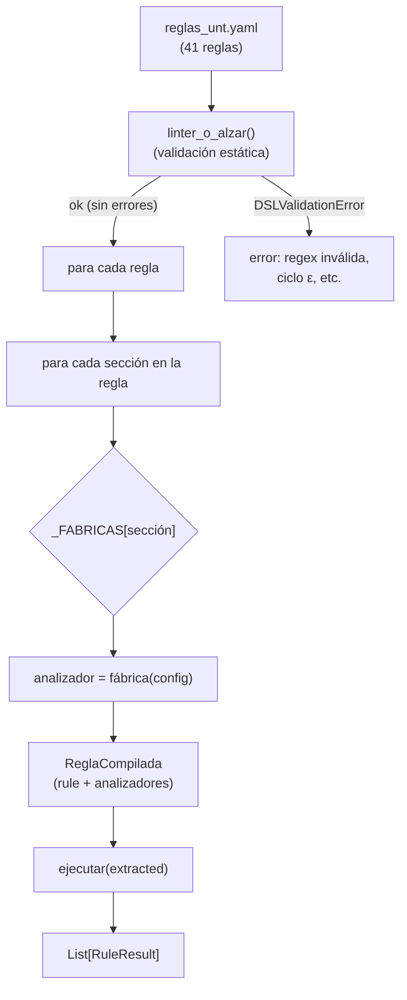
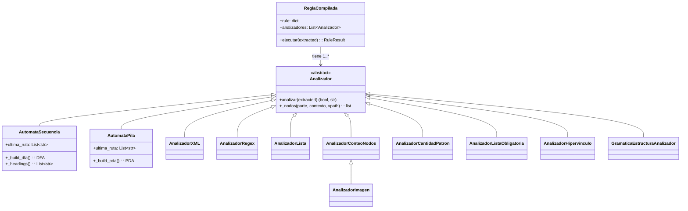
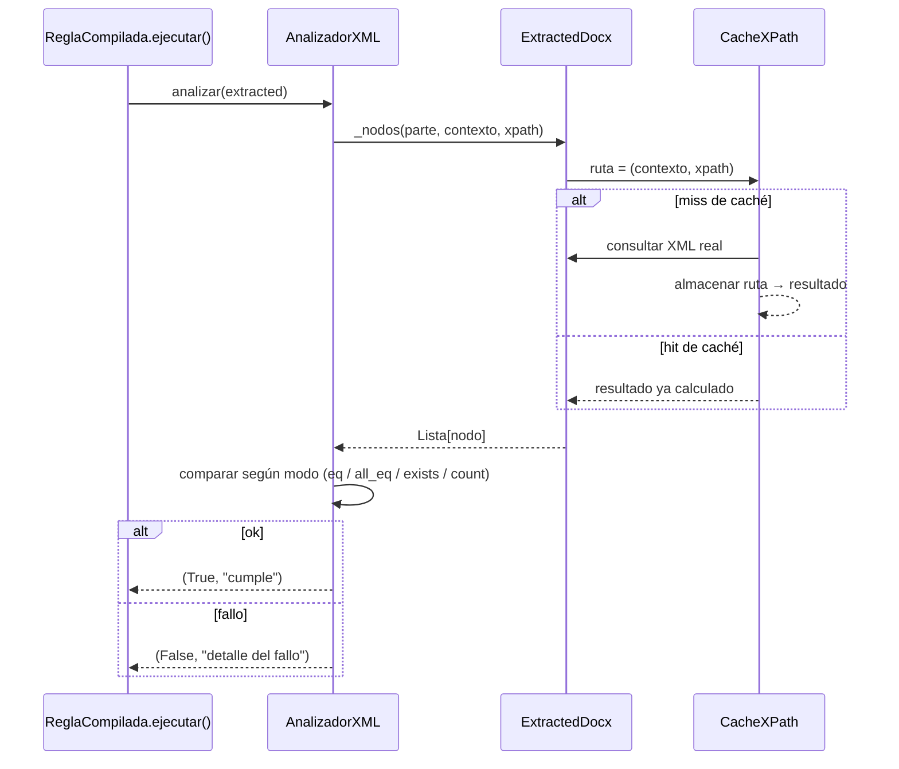

# Diseño — Compilador del DSL y linter

> Documento: `05_compilador_linter.md`
> Secciones: 1. Pipeline de compilación · 2. Fábricas · 3. Regla compilada ·
> 4. Linter en tiempo de carga · 5. Decisiones y justificación ·
> 6. Mapeo académico

## 1. Pipeline de compilación

`CompilerDSL` es la clase orquestadora que transforma un `reglas_unt.yaml`
en objetos ejecutables (`ReglaCompilada`) y, eventualmente, en un
`List[RuleResult]`.



El orden de las secciones **se preserva** (el diccionario YAML respeta el
orden de inserción en Python ≥ 3.7), lo que es crucial para que el `found`
de los fallos multi-sección reproduzca el mismo orden que legacy.

## 2. Las fábricas (`_FABRICAS`)

| Sección DSL | Fábrica (clase) | Hereda de | Tipo |
|-------------|-----------------|-----------|------|
| `atributo_xml` | `AnalizadorXML` | `Analizador` | Simple |
| `presencia_xml` | `AnalizadorXML` | `Analizador` | Simple |
| `patron_texto` | `AnalizadorRegex` | `Analizador` | Simple |
| `lista_texto` | `AnalizadorLista` | `Analizador` | Simple |
| `imagen` | `AnalizadorImagen` | `AnalizadorConteoNodos` | Herencia |
| `automata_secuencia` | `AutomataSecuencia` | `Analizador` | DFA (compuesto) |
| `gramatica_estructura` | `GramaticaEstructuraAnalizador` | `Analizador` | BNF (compuesto) |
| `automata_pila` | `AutomataPila` | `Analizador` | PDA (compuesto) |
| `patron_cantidad` | `AnalizadorCantidadPatron` | `Analizador` | Conteo |
| `conteo_nodos` | `AnalizadorConteoNodos` | `Analizador` | Conteo |
| `lista_obligatoria` | `AnalizadorListaObligatoria` | `Analizador` | Búsqueda |
| `hipervinculo_texto` | `AnalizadorHipervinculo` | `Analizador` | Conteo |

### Mecanismo de fábrica

```python
# compilador.py, método compilar():
for seccion in rule:                        # orden YAML preservado
    if seccion not in SECCIONES_ANALIZADOR:
        continue
    fabrica = _FABRICAS[seccion]
    configs = rule[seccion]
    if isinstance(configs, list):           # misma sección varias veces
        for cfg in configs:
            analizadores.append(fabrica(cfg))
    else:
        analizadores.append(fabrica(configs))
```

Una regla puede declarar una sola comprobación (`dict`) o varias del mismo
tipo (`lista`). En el caso de `proyecto_caratula_texto` (única regla con
2 secciones distintas: `patron_texto` + `atributo_xml`), ambas se
agregan como analizadores independientes que **todos** deben cumplirse.

## 3. Regla compilada (`ReglaCompilada`)



`ReglaCompilada.ejecutar()`:

```
para cada analizador:
    ok, detalle = analizador.analizar(extracted)
    si exception → ok=False con detalle del error
    si no ok    → agregar detalle a fallos
RuleResult(passed=not fallos, found="; ".join(fallos) si hay fallos, "cumple" si no)
```

La regla pase **solo si todos** los analizadores pasan (conjunción).

### 3.1 Secuencia interna de un analizador de hoja (D)

Detalle de cómo corre un check concreto (p. ej. `atributo_xml` de
`papel_tamano`) en cada regla, incluyendo la caché de XPath de F4:



La caché evita que el mismo XPath (contexto + ruta) se re-evalúe entre
reglas distintas que comparten nodo. `_nodos()` es la única puerta de
entrada a XML de los analizadores, lo que vuelve la caché transparente
(toda la comparación queda del lado Python).

## 4. Linter en tiempo de carga (`dsl_check.py`)

El linter **no importa** a `compilador.py` (evitación del ciclo, ver
`01_arq_motor.md` D5). Lo ejecuta `compilador` al inicio:

```mermaid
flowchart TD
    A["linter_o_alzar(rules_data)"] --> B["por cada regla"]
    B --> C["por cada sección"]
    C --> D{"¿tipo de sección?"}
    D -- "regex en patron/filtro" --> E["compilar regex<br/>si falla → error"]
    D -- "atributo_xml (eq/all_eq)" --> F["¿existe esperado<br/>y atributo?"}
    D -- "automata_secuencia" --> G["estados duplicados?<br/>todos opcionales?<br/>sin estados?"]
    D -- "automata_pila" --> H["sin transiciones?<br/>transición sin patrón?<br/>estados inalcanzables?<br/>aceptación inalcanzable?<br/>ciclos épsilon?"]
    E --> I["hallazgos"]
    F --> I
    G --> I
    H --> I
    I --> J{"¿hay hallazgos?"}
    J -- "sí" --> K["raise DSLValidationError<br/>(todos los hallazgos juntos)"]
    J -- "no" --> L["ok → continuar"]
```

### Errores de autómatas que el linter detecta

| Sección | Errores detectados |
|---------|-------------------|
| `automata_secuencia` | Sin `estados`; estados duplicados; todos opcionales (sin aceptación posible); estado sin `nombre`; regex inválida |
| `automata_pila` | Sin `transiciones`; transición sin `patron`; estados inalcanzables; aceptación inalcanzable; **ciclos de transiciones épsilon** (DFS con 3 colores: blanco/gris/negro) |

El ciclo de ε-transiciones es el más delicado: sin detección, un
`automata_pila` con `consumir: False` en un lazo se colgaría en
`reconocer()`. El detector DFS de `dsl_check` acota la complejidad a
`O(|transiciones|)` en tiempo de carga, no en cada validación.

## 5. Decisiones de diseño y justificación

| # | Decisión | Alternativa descartada | Justificación |
|---|----------|------------------------|---------------|
| C1 | Lint en tiempo de **carga** (F4) | Validar contra cada documento | Un error de configuración es estático; detectarlo al cargar evita reportes engañosos y loops en runtime |
| C2 | `_FABRICAS` y `_SECCIONES` como tuplas/diccionarios del módulo | Configuración externa | La lista de analizadores es cerrada; un mapping estático es explícito, testable y auto-documentado |
| C3 | `SECCIONES_ANALIZADOR` duplicada en `compilador` y `dsl_check` | Import cruzado o archivo compartido | El módulo `dsl_check` no puede importar a `compilador` (ciclo); la duplicación es pequeña (12 strings) y se mantiene sincronizada por tests (`test_linter_reglas_unt_pasan`) |
| C4 | Regla sin analizadores → se omite silenciosamente | Error | Migración incremental: una regla sin mecanismo no produce error, solo se salta. El `engine._validate_legacy` ya manejaba esta semántica |
| C5 | `ejecutar()` propaga excepciones como fallos individuales (no tumba el resto) | Excepción global | Un documento con XML inesperado en un nudo no puede anular las otras 40 reglas — hay que loguear el error y continuar |
| C6 | `found` = `"; "` de los fallos individuales de todos los analizadores | Primer fallo nada más | Un reporte completo acelera el diagnóstico del usuario (p. ej., una regla de portada puede fallar por negrita Y por tamaño: los dos motivos son útiles) |
| C7 | El order de secciones del YAML se preserva en la compilación | Orden fijo alfabético | La semántica de `found` (string) depende del orden de los fallos; si se reordenaran, el reporte de paridad legacy↔DSL dejaría de funcionar |

## 6. Mapeo académico (LFA / Compiladores)

- **Compiladores — fases del compilador**: el pipeline YAML → linter →
  compilación → ejecución es directamente análogo a:
  fuente → análisis léxico/sintáctico → generación de código → ejecución.
- **Compiladores — tabla de símbolos**: `_FABRICAS` es una tabla estática
  de símbolos (nombre de sección → fábrica de analizador).
- **LFA — clases de lenguaje regular**: el linter, al verificar que las
  regex sean válidas en tiempo de carga, ejecuta un *análisis estático* del
  lenguaje regular declarado por el usuario.
- **Ingeniería de software**: el patrón *factory method* (GoF) se usa
  aquí: cada analizador se construye por una fábrica que encapsula la
  lógica de "¿qué sección DSL → qué clase de analizador".