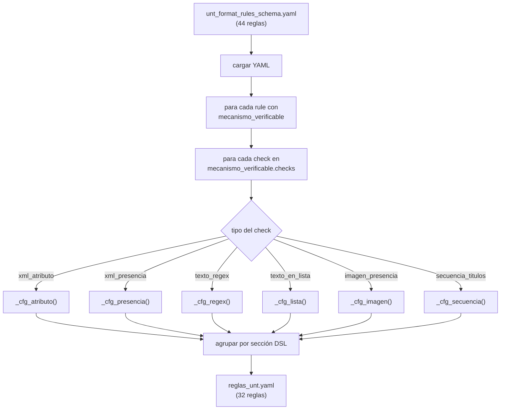
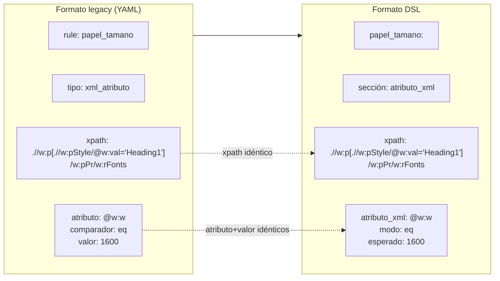
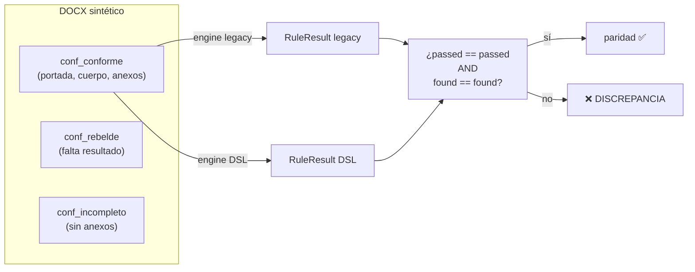

# Diseño — Migración legacy → DSL y verificación de paridad

> Documento: `06_migracion_paridad.md`
> Secciones: 1. Contexto de migración · 2. El script `migrar_legacy_a_dsl.py` ·
> 3. Mapeo de tipos · 4. Proceso de paridad · 5. Resultados ·
> 6. Decisiones y justificación · 7. Mapeo académico

## 1. Contexto de migración

El formato `unt_format_rules_schema.yaml` (legacy) contiene 44 reglas de las
cuales 32 tienen `mecanismo_verificable` (checks mecánicos). Las 12 restantes
contienen contenido semántico (resumen, abstract, contexto, etc.) que **no es
verificable** por inspección de estructura XML y quedan fuera de ambos motores.

La **fase F1** del plan de diseño consistió en migrar esas 32 reglas al
formato DSL, preservando un comportamiento idéntico — lo que se verificó con
un test de **paridad exacta**: mismo DOCX → mismo `passed` y mismo `found`
en ambos motores.

## 2. Flujo del script de migración



## 3. Mapeo de tipos de check legacy → sección DSL

| Check legacy | Sección DSL | Función del compilador |
|--------------|-------------|----------------------|
| `xml_atributo` | `atributo_xml` | `AnalizadorXML` — comparaciones `eq`, `all_eq`, `contains` |
| `xml_presencia` | `presencia_xml` | `AnalizadorXML` — comparaciones `exists`, `not_exists` |
| `texto_regex` | `patron_texto` | `AnalizadorRegex` — `comparacion: fullmatch`, `coincidencia: todos` |
| `texto_en_lista` | `lista_texto` | `AnalizadorLista` — pertenencia a lista normalizada |
| `imagen_presencia` | `imagen` | `AnalizadorImagen` — conteo de `a:blip` vía `AnalizadorConteoNodos` |
| `secuencia_titulos` | `automata_secuencia` | `AutomataSecuencia` (DFA) — estados desde `valor_esperado` |

### Generación de estados para `secuencia_titulos`

La función `_estados_secuencia(valor_esperado)` transforma la lista de
subtítulos del manual en estados DFA, aplicando la normalización de
"strings normalizados" (`mayusculas`, `ignorar_indent`, quitar
`(OPCIONAL)`) idéntica a `checks._check_secuencia.norm()`:

```
"Categorías, matriz de categorización y unidad de análisis"
  → normalizar → "CATEGORÍAS, MATRIZ DE CATEGORIZACIÓN Y UNIDAD DE ANÁLISIS"
  → slug → "categorias_matriz_de_categorizacion_y_unidad_de_analisis"
```

### 3.1 Ejemplo visual: `papel_tamano` (K)

Cómo se traduce una regla concreta del formato legacy al DSL. El check
`papel_tamano` exige que el tamaño de fuente del encabezado de nivel 1 sea
16 puntos (22 half-pts):



El cambio es puramente **sintáctico** (llaves anidadas vs lista de
secciones); el XPath y la condición se preservan exactamente. El
compilador traduce `eq` a la comparación `str(nodo.get(atributo)) ==
esperado`, la misma lógica que `checks._check_atributo` en legacy.

## 4. Proceso de verificación de paridad

El test `test_paridad_formatos.py` compara ambos motores sobre **3 DOCX
sintéticos** construidos con el factory:



### Qué se compara

| Campo | ¿Se compara? | Justificación |
|-------|--------------|---------------|
| `passed` | ✅ Sí | Es la decisión de aprobación/rechazo — la más importante |
| `found` | ✅ Sí | Texto literal de faltantes — debe ser idéntico para asegurar que el DSL no omite ni agrega motivos |
| `severity`, `message`, `expected` | No | Metadatos del reglamento, no dependen del motor |

### Regla de paridad: `ids_legacy ⊆ ids_dsl`

El DSL produce **todas** las reglas del motor legacy (el subconjunto se
agrega por la restricción `f3_no_automatizables` de 3 reglas sin mecanismo
fiable). El test verifica que cada `rule_id` que pasa el legacy también
exista en el DSL.

## 5. Resultados de la migración

| Métrica | Valor |
|---------|-------|
| Reglas legacy totales | 44 |
| Con `mecanismo_verificable` | 32 |
| Sin mecanismo (omitidas) | 12 |
| **Migradas al DSL** | **32** |
| Agregadas en F3 (mecanización manual) | 9 |
| **Total DSL actual** | **41** |
| Sin mecanismo fiable (F3) | 3 (`sistema_citas`, `proyecto_formato_general`, `suficiencia_profesional_formato`) |

### Reglas agregadas en F3 (no emitidas por el migrador)

| Regla | Sección DSL | Qué verifica |
|-------|-------------|--------------|
| `resumen_longitud` | `patron_cantidad` | Resumen ≥ 159 palabras |
| `palabras_clave_minimo` | `patron_cantidad` | ≥ 3 palabras clave (con `filtro`) |
| `referencias_minimo_cuantitativo` | `conteo_nodos` | ≥ 20 referencias |
| `referencias_minimo_cualitativo` | `conteo_nodos` | ≥ 30 referencias |
| `referencias_minimo_revision` | `conteo_nodos` | ≥ 20 referencias |
| `anexos_minimos_cuantitativo` | `lista_obligatoria` | 9 anexos obligatorios |
| `anexos_minimos_cualitativo` | `lista_obligatoria` | 8 anexos obligatorios |
| `caratula_orcid` | `hipervinculo_texto` | ≥ 1 ORCID como hipervínculo |
| `proyecto_caratula_texto` | `patron_texto` + `atributo_xml` | Texto "Proyecto de Investigación" + tamaño 26 half-pts |

> ⚠️ **Nota de implementación**: el script `migrar_legacy_a_dsl.py`
> re-genera solo las 32 reglas legacy y **sobrescribe** el archivo.
> Ejecutarlo de nuevo descarta manualmente las 9 reglas F3. El archivo
> contiene un encabezado que lo advierte.

## 6. Decisiones de diseño y justificación

| # | Decisión | Alternativa descartada | Justificación |
|---|----------|------------------------|---------------|
| M1 | Migración **one-shot automatizada** + revisión manual | Reescribir a mano cada regla | 32 reglas repetitivas (XML/regex) son perfectas para un script; pero la migración solo se corre una vez (F1), no se re-ejecuta |
| M2 | Preservar exactamente los IDs de las reglas | Generar IDs nuevos | Los IDs se usan en el reporte JSON, en la API, y en el test de paridad; cambiarlos rompería todo el contrato externo |
| M3 | Paridad sobre `(passed, found)` **exacta** | Paridad solo sobre `passed` | Un `found` distinto significaría que el DSL produce mensajes diferentes al usuario → confusión; la paridad del mensaje es la que asegura que el usuario no note el cambio |
| M4 | Las 9 reglas F3 se agregan **manualmente** (no por el migrador) | Extender el migrador para F3 | Las reglas F3 usan analizadores nuevos (`patron_cantidad`, `conteo_nodos`, `lista_obligatoria`, `hipervinculo`) que no tienen equivalente en legacy; un migrador genérico generaría salidas incorrectas |
| M5 | `proyecto_caratula_texto` tiene 2 secciones (`patron_texto` + `attributo_xml`) | Un check compuesto | Representa una regla real con 2 condiciones: presencia del texto **Y** tamaño. La multiplicidad de secciones de `compilar()` ya lo soporta |

## 7. Mapeo académico (LFA / Compiladores)

- **Traducción de lenguajes**: la migración es un *traductor de dominio*:
  un lenguaje de reglas (legacy) se transforma en otro lenguaje (DSL)
  preservando la semántica — la definición misma de *equivalencia semántica*
  en la teoría de lenguajes formales.
- **Testing de regresión (ingeniería de software)**: el test de paridad es
  un *test de regresión*: dado un mismo input, ambos sistemas deben producir
  la misma salida, concepto central de la verificación de corrección de
  compiladores (tema de Compiladores, validación de traductores).