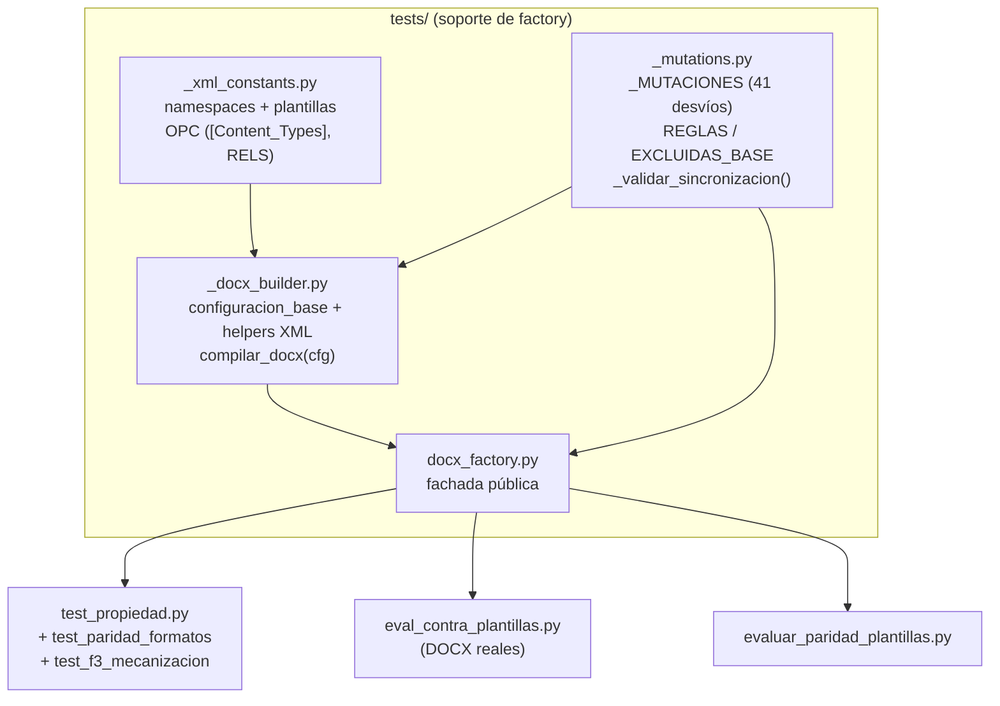
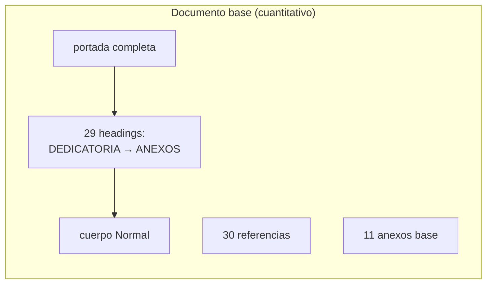
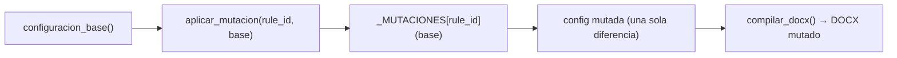
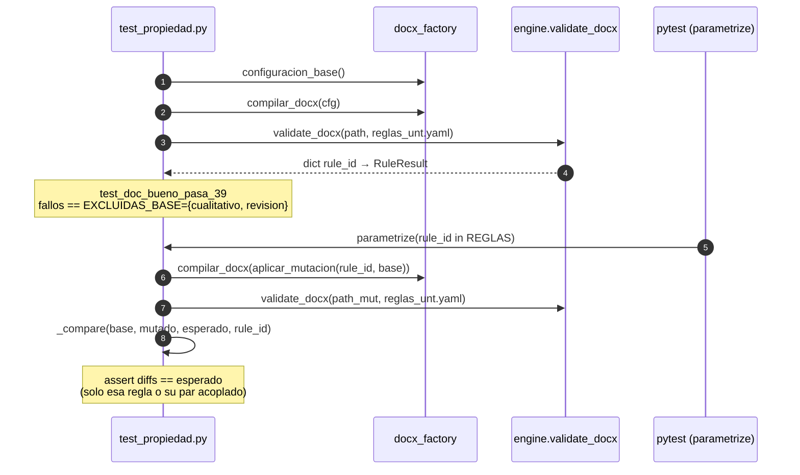
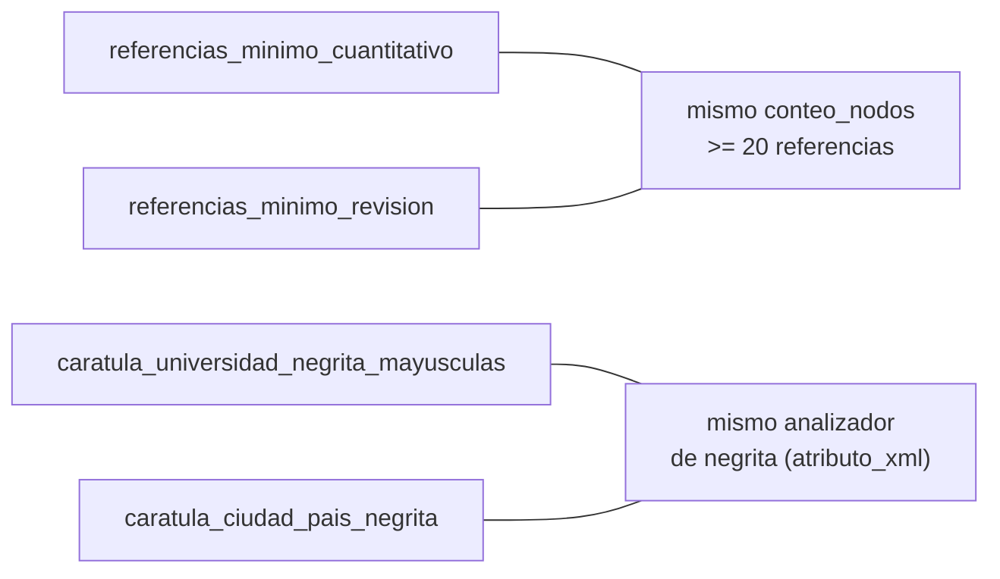

# Diseño — Arquitectura de pruebas (factory DOCX + mutaciones)

> Documento: `07_arquitectura_tests.md`
> Secciones: 1. Objetivo · 2. Componentes del factory · 3. El documento base ·
> 4. Mutaciones (una por regla) · 5. Tests de propiedad (F6) ·
> 6. Reglas acopladas · 7. Decisiones y justificación · 8. Mapeo académico

## 1. Objetivo

La suite de tests debe poder demostrar dos propiedades del motor DSL de
manera **determinista y reproducible** (sin depender de archivos DOCX reales
externos, imposibles de versionar por binariedad/licencia):

1. **El documento "bueno" pasa** las 39/41 reglas mecánicas.
2. **Cada desvío MÍNIMO** (`mutación`) afecta únicamente a la regla que
   pretendía romper (o a su par acoplado).

Para eso se construyó un *factory* de DOCX sintéticos con XML
WordprocessingML generado en memoria.

## 2. Componentes



### Rol de cada pieza

| Archivo | Contenido | Dependencias |
|---------|-----------|--------------|
| `_xml_constants.py` | Namespaces OPC (`WNS`, `ANS`, `PNS`, `RNS`, `WPN`) y plantillas XML (`CONTENT_TYPES`, `RELS` con rIds para footer, imagen, ORCID) | — |
| `_docx_builder.py` | `configuracion_base()` (portada completa, 29 headings cuantitativos, 11 anexos, 175 palabras de resumen, 30 referencias) + helpers XML + `compilar_docx(cfg) → ruta .docx` | `_xml_constants` |
| `_mutations.py` | Catálogo `_MUTACIONES` (función por regla que desvía la config base) + metadatas `REGLAS`, `REGLAS_ACOPLADAS`, `EXCLUIDAS_BASE` | `_docx_builder`, `yaml` |
| `docx_factory.py` | Fachada que re-exporta la API pública | los `_*` |

## 3. El documento base (`configuracion_base`)

Diseño del DOCX sintético — cumple el esquema **cuantitativo** (plan por
defecto de la migración) y permite reconocer a la vez los esquemas
cualitativo y de revisión **insertando cabeceras** sin romper el orden:



Los esquemas alternativos se insertan con listas `_ANADIDAS_CUALITATIVO`
(categorías, participantes, análisis y discusión de resultados, …) y
`_ANADIDAS_REVISION` (METODOLOGÍA DE REVISIÓN, DESARROLLO…, CONCLUSIONES
Y RECOMENDACIONES). Como el DFA **salta** los títulos que no matchean su
transición actual, un documento que contiene los tres esquemas sigue siendo
reconocido por los tres autómatas a la vez.

## 4. Mutación: un desvío mínimo por regla

Cada regla de `reglas_unt.yaml` tiene una función de mutación que **cambia
exactamente un aspecto** de la configuración para hacer fallar esa regla
(desvío mínimo):

| Regla | Mutación (ejemplo) |
|-------|--------------------|
| `papel_tamano` | cambiar `w:w` de 11906 a 10000 |
| `fuente_principal` | eliminar `w:rFonts` del run del cuerpo |
| `interlineado` | cambiar el `w:spacing` de 1.5 a 1.0 |
| `margen_superior` | cambiar `w:top` de 1440 a 720 |
| `resumen_longitud` | reducir el texto a < 159 palabras |
| `estructura_tinv_cuantitativo` | eliminar un heading del esquema |
| `caratula_orcid` | quitar el hipervínculo `w:hyperlink` |
| … | … |



### Cadena de sincronización obligatoria

`_validar_sincronizacion()` corre **al importar** `_mutations`: si el
conjunto de IDs de `_MUTACIONES` difiere de los de `reglas_unt.yaml`, el
import lanza `RuntimeError`. Esto implica: si alguien agrega una regla al
YAML sin mutación (o al revés), la recolecta de tests **falla sin que haya
que recordar actualizar un test**.

```
[MODULE LOADED] _mutations.py:
    if set(_MUTACIONES) != set(reglas_unt.yaml["reglas"] ids):
        raise RuntimeError("DESINC: agregar mutación o quitar del YAML")
```

## 5. Tests de propiedad (F6)



Explicación del comparador `_compare`:

```
a = estado(base)      # rule_id → (passed, found)
b = estado(mutado)    # idem
assert set(a) == set(b) == set(REGLAS)          # 41 reglas presentes
diffs = { rid | a[rid] != b[rid] }
assert diffs == esperado                          # solo el par esperado
```

> **Nota técnica de los autómatas de estructura**: reportan en `found` un
> contador interno `headings=N` que cambia ante cualquier inserción o
> renombrado de cabeceras (aunque la semántica no cambie). Por eso, para las
> reglas `estructura_tinv_*`, el observable comparado es **solo `passed`**
> (`found = None`). Para el resto se compara `(passed, found)`.

## 6. Reglas acopladas por mecanismo idéntico

Ciertas reglas comparten mecanismo subyacente y fallan en conjunto ante la
misma mutación. Están declaradas en `REGLAS_ACOPLADAS`:



`esperado = REGLAS_ACOPLADAS[rule_id] ∪ {rule_id}` al momento de comparar.

## 7. Decisiones de diseño y justificación

| # | Decisión | Alternativa descartada | Justificación |
|---|----------|------------------------|---------------|
| T1 | Factory determinista (XML sintético suscriptible) | DOCX reales en git | Reproducible y versionable; un DOCX real puede no estar disponible en CI y no se puede versionar |
| T2 | Una mutación **mínima** por regla | Mutaciones múltiples / aleatorias | Aislar la causa: si el desvío solo rompe su regla, el mecanismo está bien; si rompe otras, hay acoplamiento (y se declara en `REGLAS_ACOPLADAS`) |
| T3 | `_validar_sincronizacion()` en el import | Un test más de cobertura | Es un *fail-fast en la recolecta* — el error se produce antes incluso de ejecutar tests, no como un `assert` olvidable |
| T4 | Comparar `(passed, found)` excepto estructura (`passed` solo) | Comparar solo `passed` | Mensajes iguales = paridad total; excepto en la estructura (donde `found` es un contador interno, no un mensaje semántico) |
| T5 | Los esquemas alternativos **insertados** en el base (no excluidos por `EXCLUIDAS_BASE`) | Configs separadas por esquema | `EXCLUIDAS_BASE` = las 2 reglas de esquema no-cuantitativo; el base con cabeceras insertadas permite a la vez no romper la paridad de los demás checks |
| T6 | `docx_factory` como fachada re-exporta | Import interno directo | Reduce el acoplamiento de los tests a los helpers internos; `test_propiedad` solo conoce `docx_factory` |

## 8. Mapeo académico (LFA / Compiladores)

- **Testing basado en propiedades (ingeniería de software)**: el *test de
  propiedad* es la versión determinista de los "property-based tests" de la
  metodología moderna de testing (cada mutación es un invariante que el
  sistema debe romper).
- **Cobertura de ramas de un traductor**: la validación de que todas las
  reglas tienen mutación recuerda la forma en que un compilador se verifica
  con casos de prueba por cada regla de producción de la gramática — la
  cobertura de reglas de la CFG (Compiladores).
- **Corrección de un traductor**: paridad `(passed, found)` es la noción de
  *semántica preservada* por una transformación, tema central en
  Compiladores y en lenguajes formales (equivalencia de lenguajes).