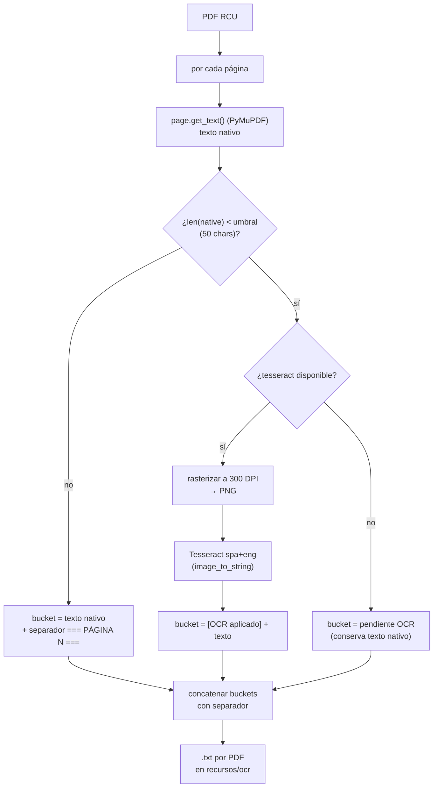

# Diseño — OCR de reglamentos (RCU de la UNT)

> Documento: `08_flujo_ocr.md`
> Secciones: 1. Objetivo · 2. Estrategia híbrida · 3. Flujo de datos ·
> 4. Decisiones y justificación · 5. Formato de salida · 6. Mapeo académico

## 1. Objetivo

Convertir los PDF de los **reglamentos de la UNT** (RCU-274-2022,
RCU-220-2022-Líneas de investigación) en texto plano para poder buscar y
citar los párrafos del manual en el YAML de reglas. El contenido se usa al
construir la base de reglas (las reglas citan párrafos tipo
"párr. 275-319") y para el mapeo de ambigüedades.

## 2. Estrategia híbrida (texto nativo + OCR)

Los RCU tienen capa de texto real en la mayoría de páginas (texto nativo),
pero algunas páginas están **escaneadas/rasterizadas** (sin capa de texto).
La estrategia aplicada:

- **Intento 1 — texto nativo**: `page.get_text()` con **PyMuPDF**. Rápido y
  sin dependencias externas.
- **Intento 2 — si < umbral (50 chars)**: rasterizar la página a **300 DPI**
  → PNG → **Tesseract** (`spa+eng`) vía `pytesseract`.
- **Resiliencia**: si `tesseract` **no está instalado**, la página se marca
  como **"pendiente OCR"** y se conserva el texto nativo disponible. La
  ejecución no aborta.



## 3. Parámetros por defecto

| Parámetro | Valor | Justificación |
|-----------|-------|---------------|
| `--umbral` | `50` | Una página con <50 chars de texto nativo es una página escaneada (o un rincón decorativo), no un párrafo real. Valor empírico sobre los RCU |
| DPI | `300` | Compromiso entre fidelidad OCR (≥300 recomendado por Tesseract) y tiempo de cómputo |
| idioma | `spa+eng` | Manuales en español con citas/términos en inglés (abstract) |
| salida | `recursos/ocr/<stem>.txt` | Texto con separador `=== PÁGINA N ===` para mapear fragmentos a párrafos del reglamento |

## 4. Formato de salida

```text
=== PÁGINA 1 ===
[texto nativo de la página 1]

=== PÁGINA 2 ===
[OCR aplicado]
[texto reconocido de la página 2]

=== PÁGINA 3 ===
[TEXTO NO NATIVO — pendiente OCR (tesseract no disponible)]
[texto nativo parcial]

...
```

El separador por página permite **mapear citas a párrafos**: cuando la regla
dice `ubicacion: párr. 275-319`, se busca en el `.txt` el fragmento entre
las marcas `=== PÁGINA N ===` correspondientes.

## 5. Decisiones de diseño y justificación

| # | Decisión | Alternativa descartada | Justificación |
|---|----------|------------------------|---------------|
| O1 | Intentar **siempre** texto nativo primero | OCR directamente | Los RCU tienen capa de texto; el OCR es caro (slow) y propenso a error. El umbral filtra solo lo que realmente lo necesita |
| O2 | **No detenerse** si falta `tesseract` | Fallar con error | Los PDFs RCU se leen mejor nativo; el reglamento sigue siendo utilizable aunque algunas páginas queden en "pendiente" |
| O3 | Marcar `[OCR aplicado]` / `[pendiente...]` en el `.txt` | Texto plano sin marcas | Permite auditar en el `.txt` qué páginas usaron OCR vs nativo → trazabilidad |
| O4 | `=== PÁGINA N ===` como separador | Nada | Requisito del uso posterior: mapear citas a párrafos del manual |
| O5 | Dependencias solo en el entorno Nix | Requisito global | `pymupdf` y `pytesseract` están declarados en `flake.nix` (no en `pyproject.toml`); el script es un utilitario de oficina, no parte del motor runtime |

## 6. Mapeo académico (LFA / Compiladores)

- **Reconocimiento de patrones / PVC**: el OCR es reconocimiento
  estadístico de patrones (temas de visión y de algoritmos). El split
  nativo/OCR es una estrategia de **hibridación de modelos** común en
  procesamiento de documentos.
- **Preprocesamiento de lenguaje**: la etapa de rasterizado a PNG a 300 DPI
  es el "compilador inverso" (imagen → texto), análogo al pipeline inverso
  de un OCR (segmentación → reconocimiento → postprocesado).