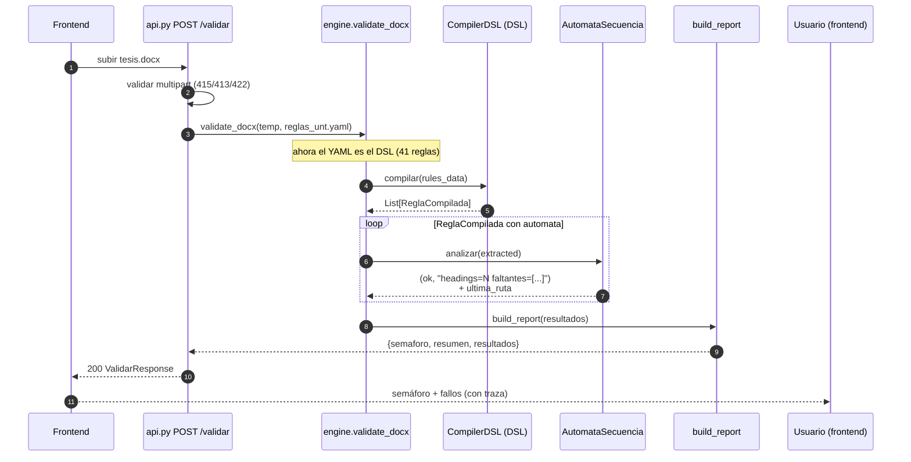
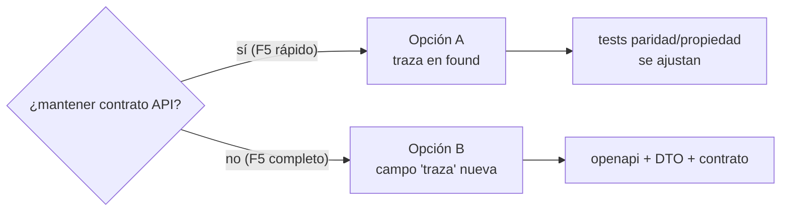

# Diseño — F5: conexión de la API al DSL (IMPLEMENTADA — Opción A)

> Documento: `09_f5_enlace_api_propuesta.md`
> Estado: ✅ **IMPLEMENTADA** (Opción A) — el enlace `api.py → reglas_unt.yaml`
> y la traza en `found` están realizados en la rama `semana4`. Originalmente
> nació como propuesta (F5 del `PLAN_DSL.md`); se documenta la decisión de
> diseño *antes* de escribir el código (a diferencia del resto del paquete,
> que documenta lo ya construido).

## 1. Contexto

Estado previo a F5 (documentado para la traza de decisión):

- La **API** (`api.py`) cargaba **el YAML legacy** `unt_format_rules_schema.yaml`
  (44 reglas, motor legacy).
- El **motor directo** (CLI/scripts) podía usar `reglas_unt.yaml` (41 reglas,
  motor DSL con las 9 reglas F3 adicionales).
- Las 9 reglas F3 agregadas (`resumen_longitud`, `referencias_minimo_*`,
  `anexos_minimos_*`, `caratula_orcid`, `proyecto_caratula_texto`) **no se
  evaluaban** en las respuestas de la API.

**F5 consiste en dos cosas** (según `docs/NOTA_F5_Y_API_DSL.md`):
1. **Enlazar la API al DSL**: `REGLAS_YAML_PATH` apunta a `reglas_unt.yaml`
   (cambio de 1 línea) — el motor DSL se ejecuta dentro de la API.
2. **Traza de los autómatas en el reporte**: que en el `found` de una regla
   de autómata aparezca el camino de estados recorrido (`ruta_estados`
   / `ultima_ruta`, ya producido en F4), para que el usuario sepa *dónde*
   se desvió el documento.

## 2. Propuesta — diagrama de secuencia



## 3a. Opción A — traza embebida en `found` ✅ IMPLEMENTADA

Modificación mínima ejecutada: `ReglaCompilada.ejecutar()` (compilador.py)
anexa `ultima_ruta` al detalle de un fallo de autómata
(`_detalle_con_traza`):

```
act: ok=False, detail = "headings=18 faltantes=[...]"
nuevo: detail += f" ruta={' -> '.join(ultima_ruta)}"
```

Pros (cumplidos): sin cambio de contrato API. Contras (aceptados): el
`found` se vuelve más largo. Impacto en tests (aplicado): `test_paridad`
y `test_propiedad` comparan para los `estructura_tinv_*` solo `passed` (la
traza modifica el `found` literal de esas reglas); las demás reglas
conservan paridad `(passed, found)`.

## 3b. Opción B — campo nuevo opcional en el reporte ❌ DESCARTADA

(mantenida como alternativa documentada; no implementada)

Agregar a `RuleResult` un campo `traza: List[str]` (o `None`) poblado solo
por los analizadores de autómatas, y a `ResultadoReglaAPI` un campo
`traza: List[str] | None`.

Pros: reporte estructurado, no rompe mensajes existentes. Contras: cambia el
contrato API (v1.1 → v1.2) y el `openapi_spec.json`; requiere migración del
DTO del Integrante 1.



## 4. Decisiones de diseño y justificación

| # | Decisión propuesta | Alternativa | Justificación |
|---|--------------------|-------------|---------------|
| F1 | `REGLAS_YAML_PATH` → `reglas_unt.yaml` | Seguir con legacy | Único cambio para que la API evalúe las 9 reglas F3 que ya están en el DSL. No rompe el contrato (`RuleResult` igual) |
| F2 | Traza disponible ya en F4 (`ultima_ruta`) | Recalcular | La ruta la produce el autómata durante el análisis; duplicarla sería derroche |
| F3 | Opción A elegida (traza en `found`) | Opción B descartada | La traza en `found` es más barata y no rompe el contrato v1.1 ni el DTO del Integrante 1; el campo estructurado seguirá siendo la mejora si en el futuro se versiona a v1.2 |
| F4 | Mantener la paridad: los `estructura_tinv_*` comparan solo `passed` | Comparar también `found` | El `found` de estos autómatas lleva el contador interno `headings=N` (cambia ante reordenamientos de cabeceras) — compararlo rompería tests |
| F5 | Probar `nix flake check` tras el cambio | — | El envejecido array de checks y el contrato deben seguir pasando (142 tests) |

## 5. Riesgos y checklist

| Riesgo | Mitigación |
|--------|-----------|
| La API pasa del legacy (32/44) al DSL (41/44) y cambian los `found` de la salida | Correr `test_api_contract.py` + `test_paridad_formatos.py` y revisar el diff del ejemplo `ejemplo_respuesta_motor.json` |
| Los tests de `found` de `test_propiedad` fallan si la traza cambia el string | Ajustar a comparar solo `passed` para los autómatas, o excluir la traza del comparador |
| El contrato `openapi_spec.json` queda desactualizado (Opción B) | Regenerar desde FastAPI (`/openapi.json`) |
| La regla `proyecto_formato_general` no está en el DSL (no automatizable) | Queda documentada como no-automatizable, sin impacto |

**Checklist** (estado real):
- [x] Cambiar `REGLAS_YAML_PATH` → `reglas_unt.yaml` (api.py).
- [x] Decidir Opción A (traza en `found`).
- [x] Correr `pytest tests/ -q` — **142 passed**.
- [x] Regenerar `ejemplo_respuesta_motor.json` (ahora salida DSL, 41 reglas).
- [ ] `openapi_spec.json`: **no cambia** (Opción A no altera el contrato v1.1).
- [ ] `docs/CONTRATO_API.md` changelog: no aplica (sigue v1.1).

## 6. Mapeo académico (LFA / Compiladores)

- El concepto de **traza del autómata** es la capacidad de un parseador de
  reportar la *derivación* (camino) que siguió — lo que en Compiladores se
  llama *mensaje de error con contexto* (el parser sabe en qué estado quedó
  atascado y reporta los símbolos esperados), y en LFA es la **secuencia de
  estados por la que transitó el autómata** sobre la entrada.
- Mantener la paridad de `found` es preservar la **equivalencia semántica**
  entre dos representaciones (regla de la F1) incluso al agregar traza.